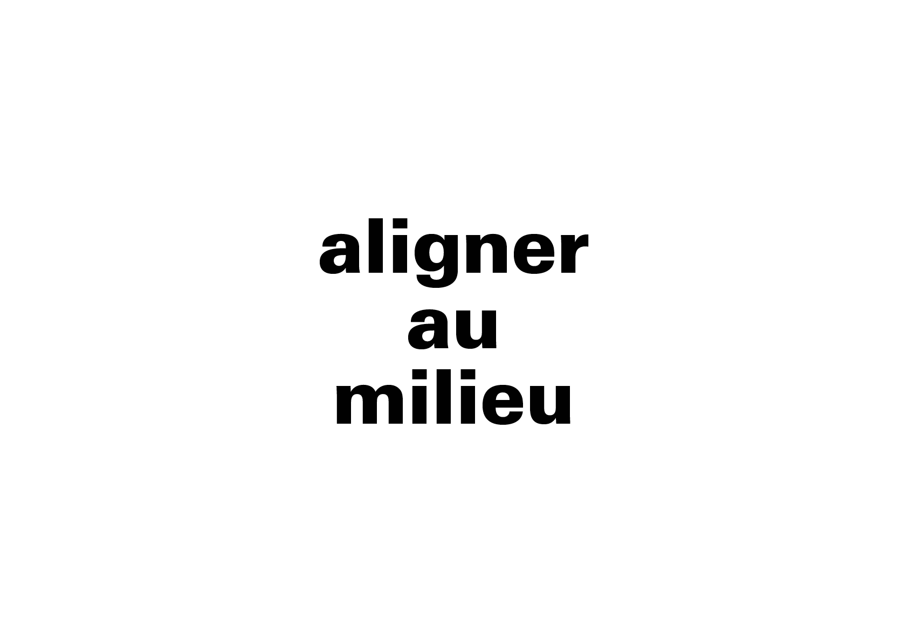

# ⏹️ Mise en forme de la ligne

La mise en forme de la ligne se réfère à l’organisation globale des mots dans l’espace. Elle détermine le rythme visuel et la cohérence d’ensemble.
  
### &nbsp;

| |
|:---:|
| Abc |

### Sources

<!-- - **Prénom Nom**  
  *Titre*, 0000 -->

<!-- [^1]: Adrian Frutiger, *Type, Sign, Symbol*, 1980 -->

