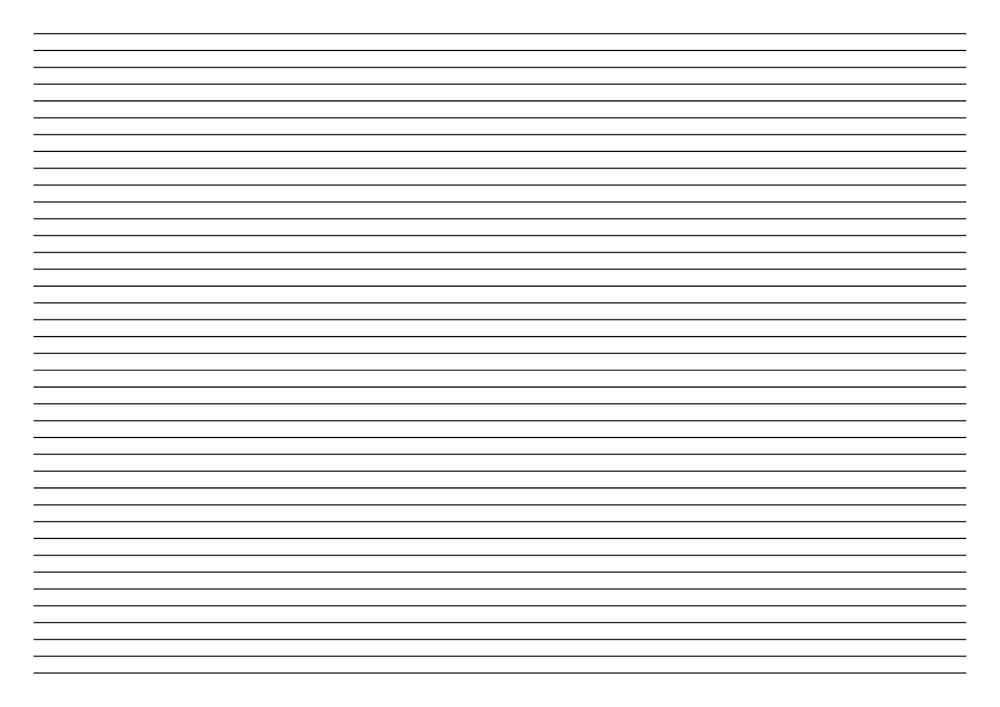

# 🌍 Macro-typographie des colonnes

  
### &nbsp;

# Mirroir de page  

| |
|:---:|
| Abc | 

# Zone de texte  

| |
|:---:|
| Abc | 

# Marges  

| |
|:---:|
| Abc | 

# Gris de texte  

| |
|:---:|
| Abc | 

# Division verticale  

| |
|:---:|
| Abc | 

# Grille de ligne de base  

| |
|:---:|
| Abc |

### Sources

<!-- - **Prénom Nom**  
  *Titre*, 0000 -->

<!-- [^1]: Adrian Frutiger, *Type, Sign, Symbol*, 1980 -->

