# 🦠 Micro-typographie

## Index
- [Langue](#-langue)
  - [Les guillemets](#-les-guillemets)
- [Ponctuation](#-ponctuation)
  - [L’apostrophe](#-lapostrophe)
  - [Le point, la virgule](#-le-point-la-virgule)
  - [Les points de suspension](#-les-points-de-suspension)
- [Espaces](#-espaces)
- [Césures](#-cesures)
- [Parenthèses](#-parentheses)
- [Chiffres](#-chiffres)
  - [Les types de chiffres](#-les-types-de-chiffres)
  - [Les fractions](#-les-fractions)
  - [Les opérations](#-les-operations)
  - [Les nombres](#-les-nombres)
  - [Les heures](#-les-heures)
  - [Les index](#-les-index)
- [Symboles](#-symboles)
  - [Arobase](#-arobase)
  - [Esperluette](#-esperluette)
  - [Devises](#-devises)
  - [Copyright](#-copyright)
  - [Flèches](#-fleches)
- [Substitutions](#-substitutions)
  - [Ligatures](#-ligatures)
  - [Formes sensibles à la casse](#-formes-sensibles-a-la-casse-case)
  - [Stylistic set](#-stylistic-set)

  
&nbsp;

# Langue {#-langue}  

## Les guillemets {#-les-guillemets}

| |
|:---:|
| Les guillemets sont des signes de ponctuation utilisés par paire pour mettre en évidence une citation ; chaque langue possède ses propres formes. | 

# Ponctuation {#-ponctuation}  

## L’apostrophe {#-lapostrophe}

|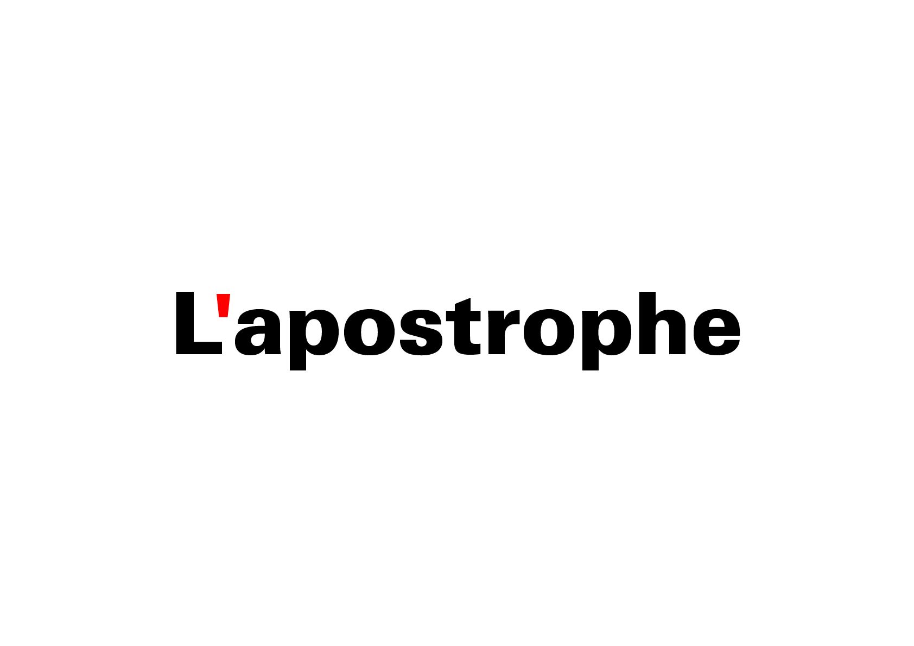 |
|:---:|
| L’apostrophe est un signe typographique servant à signaler l’élision d’une lettre | 

## Le point, la virgule {#-le-point-la-virgule}

| |
|:---:|
| Le point et la virgule sont des signes de ponctuation qui marquent la fin ou une pause dans une phrase. | 

## Les points de suspension {#-les-points-de-suspension}

| |
|:---:|
| Les points de suspension marquent une interruption ou une hésitation, ils laissent la phrase en suspens. | 

# Espaces {#-espaces}  

|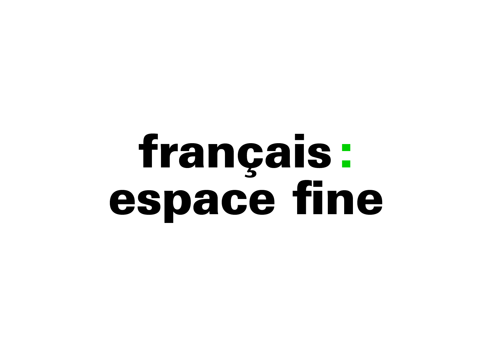 |
|:---:|
| Les signes de ponctuation ( : ; ! ? ) doivent être précédés en français d’une espace fine insécable. | 

| |
|:---:|
| Les signes de ponctuation ( : ; ! ? ) doivent être précédés en français d’une espace fine insécable. | 

# Césures {#-cesures}  

|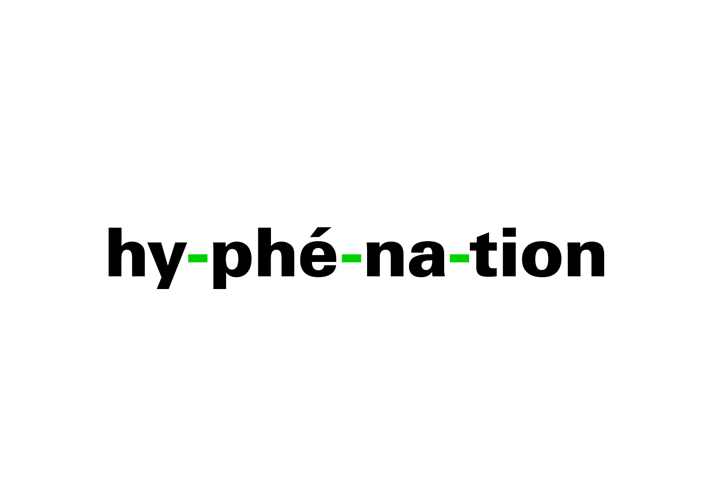 |
|:---:|
| La césure permet de couper un mot en fin de ligne selon des règles précises, afin d’améliorer la justification et l’équilibre typographique. | 

# Parenthèses {#-parentheses}  

|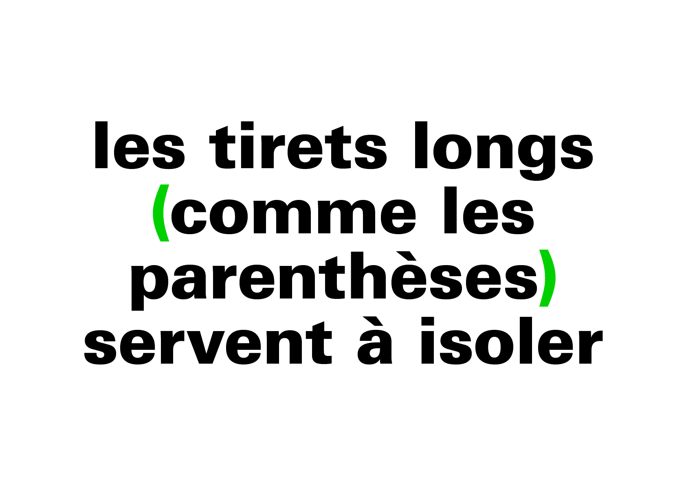 |
|:---:|
| Les parenthèses encadrent un élément explicatif ou secondaire, tandis que les tirets peuvent introduire, isoler ou ponctuer une phrase selon leur longueur. | 

# Chiffres {#-chiffres}  

## Les types de chiffres {#-les-types-de-chiffres}

|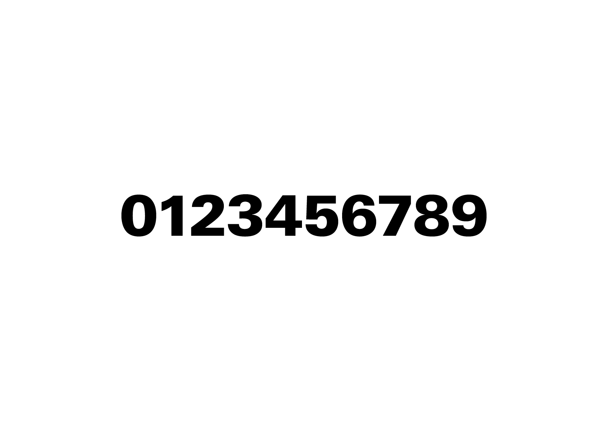 |
|:---:|
| Les chiffres peuvent varier en forme (proportionnels, tabulaires, elzéviriens) selon leur contexte typographique: texte courant, tableau ou encore affichages en grande taille. | 

## Les fractions {#-les-fractions}

|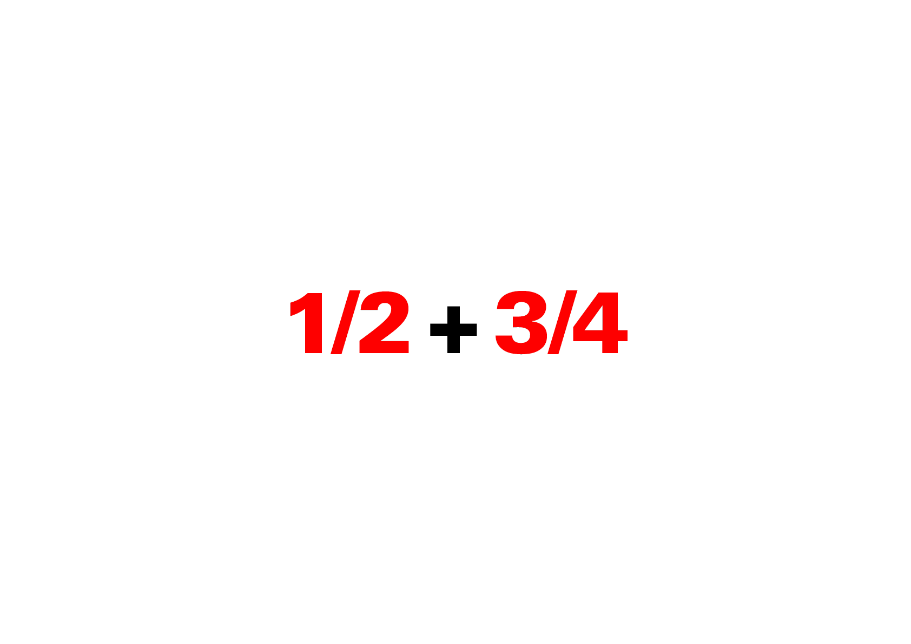 |
|:---:|
|  | 

## Les opérations {#-les-operations}

| |
|:---:|
| Les opérations mathématiques (comme la multiplication) nécessite l'usage de signes distincts des lettres ou autres symboles voisins. | 

## Les nombres {#-les-nombres}

| |
|:---:|
| Les nombres s’écrivent selon des conventions propres à chaque langue, notamment pour le séparateur de milliers ou de décimales. (ici en français CH) | 

## Les heures {#-les-heures}

| |
|:---:|
| Les heures s’écrivent avec des conventions typographiques variables propres à chaque langue. | 

## Les index {#-les-index}

| |
|:---:|
| Les index s’écrivent avec des abréviations spécifiques et évitent les formes anglicisées ou incorrectes comme « 2ème ». | 

# Symboles {#-symboles}  

## Arobase {#-arobase}  

| |
|:---:|
| Le signe arobase (@) est utilisé principalement dans les adresses électroniques, mais il possède aussi des usages historiques comme symbole commercial ou d’unité de mesure. | 

## Esperluette {#-esperluette}  

|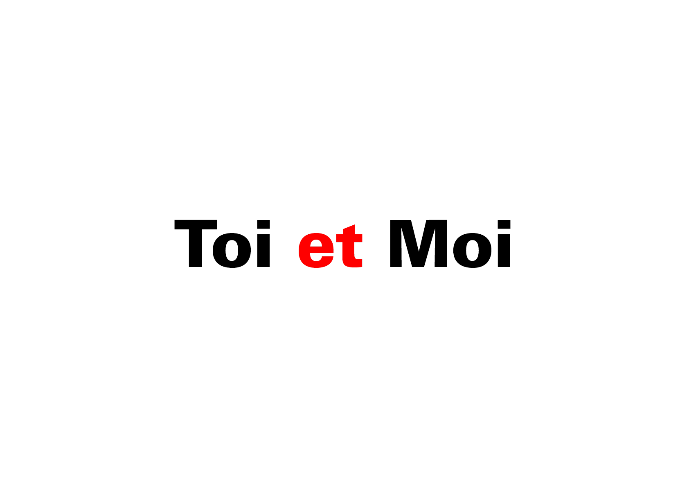 |
|:---:|
| L’esperluette (&) représente la conjonction « et », issue de la ligature des lettres latines E et T. | 

## Devises {#-devises}  

|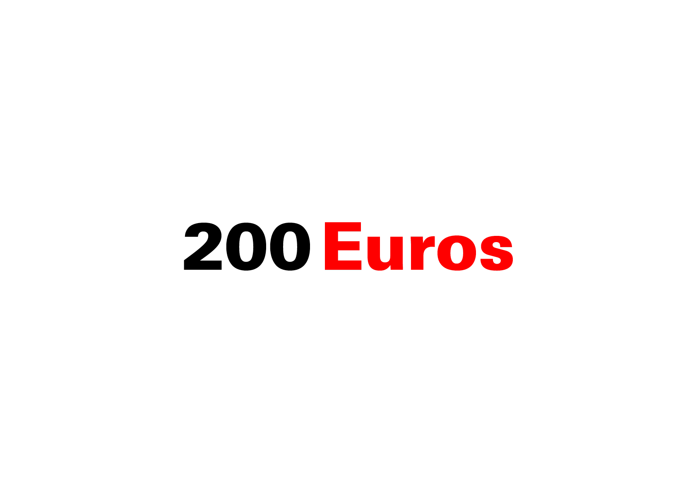 |
|:---:|
| Les signes monétaires (€, $, £, etc.) indiquent les devises et suivent des règles typographiques spécifiques selon les langues. | 

## Copyright {#-copyright}  

| |
|:---:|
| Le signe © indique la protection d’une œuvre par le droit d’auteur, souvent accompagné de l’année et du nom du détenteur. | 

## Flèches {#-fleches}  

|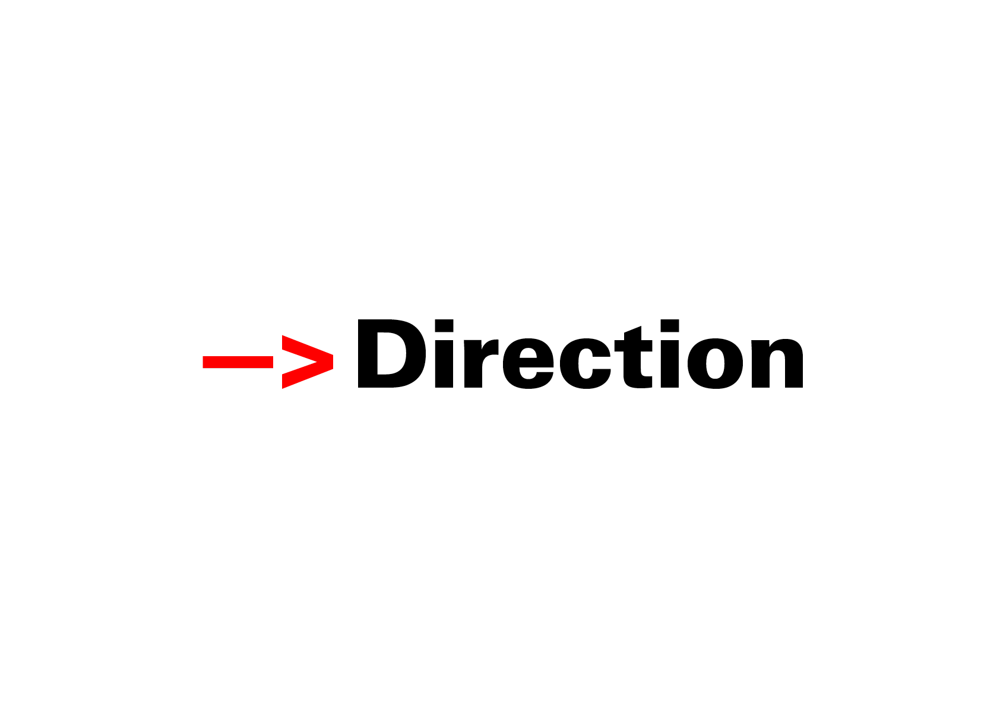 |
|:---:|
| Les flèches (→, ↑, ↓, etc.) servent à indiquer une direction, un mouvement ou une relation dans le texte ou la mise en page. |

# Substitutions {#-substitutions}  

## Ligatures (liga) {#-ligatures}  

|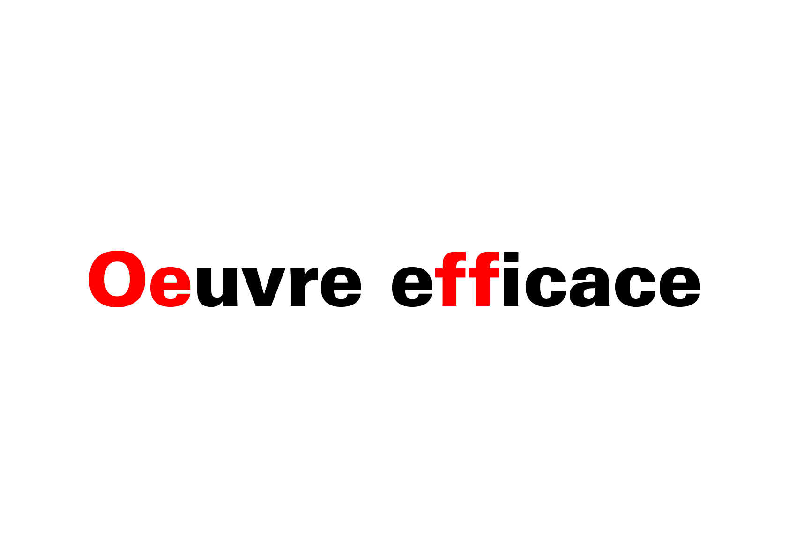 |
|:---:|
| Les ligatures sont des combinaisons de lettres (fi, fl, etc.) créées pour améliorer la lisibilité et l’esthétique du texte. | 

## Formes sensibles à la casse (case) {#-formes-sensibles-a-la-casse-case}  

|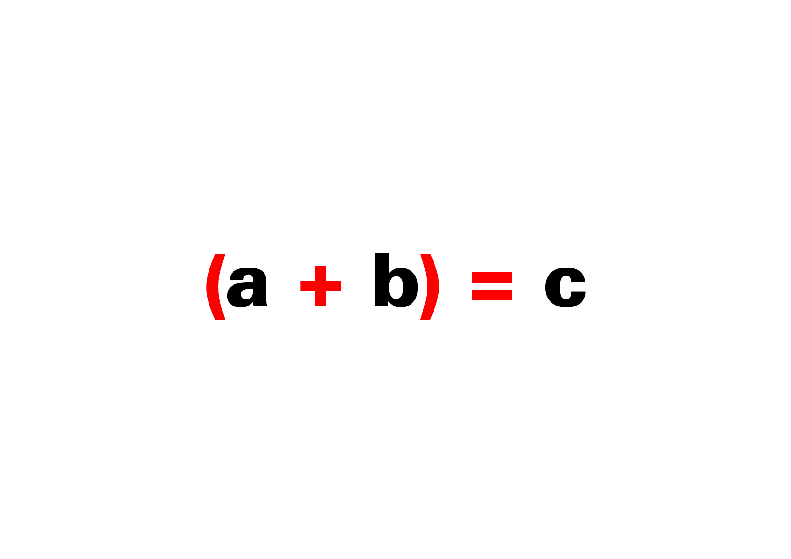 |
|:---:|
| Certaines glyphes changent de forme selon qu’elles apparaissent en majuscules ou en minuscules, comme les parenthèses ou certains chiffres. | 

## Stylistic set (ss00) {#-stylistic-set}  

|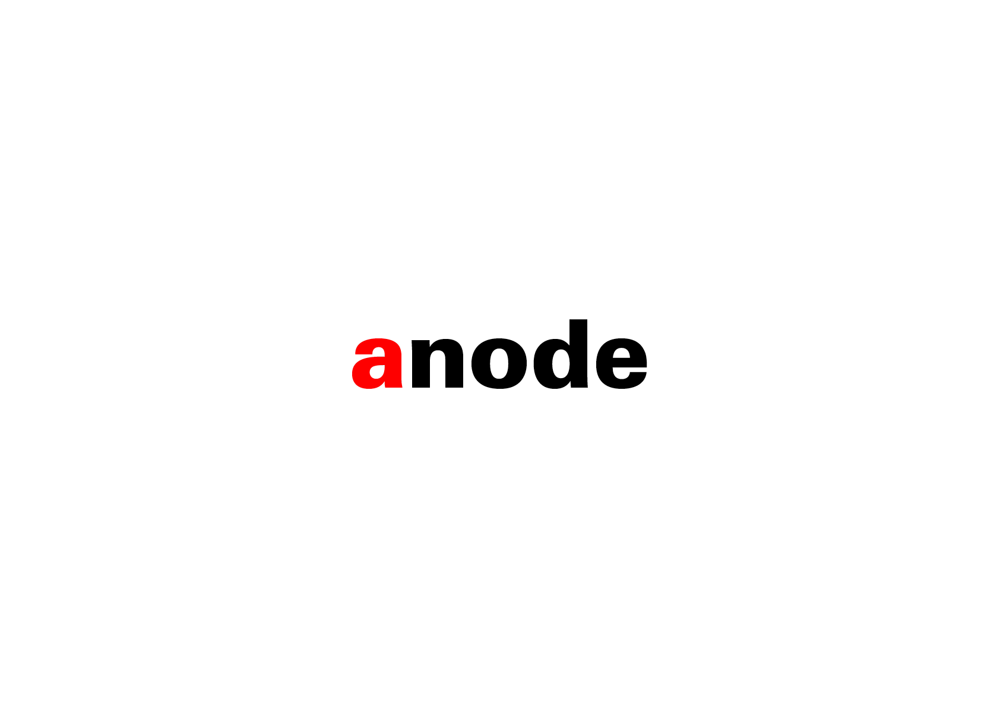 |
|:---:|
| Les ensembles stylistiques (ss01, ss02, etc.) proposent des variantes alternatives de glyphes, activables grâce aux fonctionnalités OpenType. |

### Sources

<!-- - **Prénom Nom**  
  *Titre*, 0000 -->

<!-- [^1]: Adrian Frutiger, *Type, Sign, Symbol*, 1980 -->

