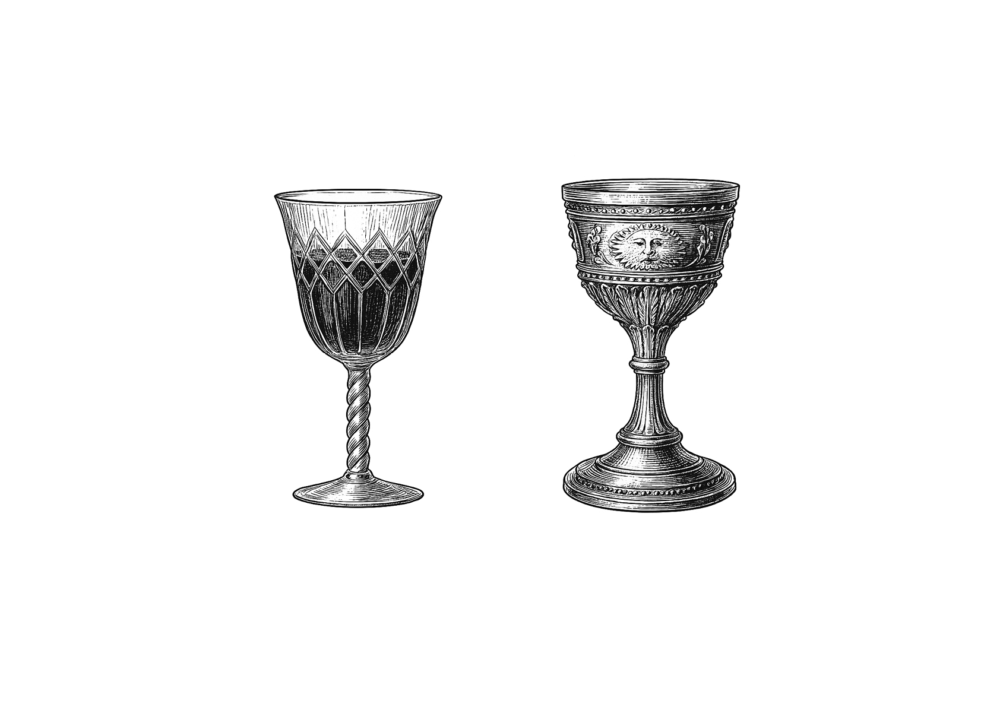
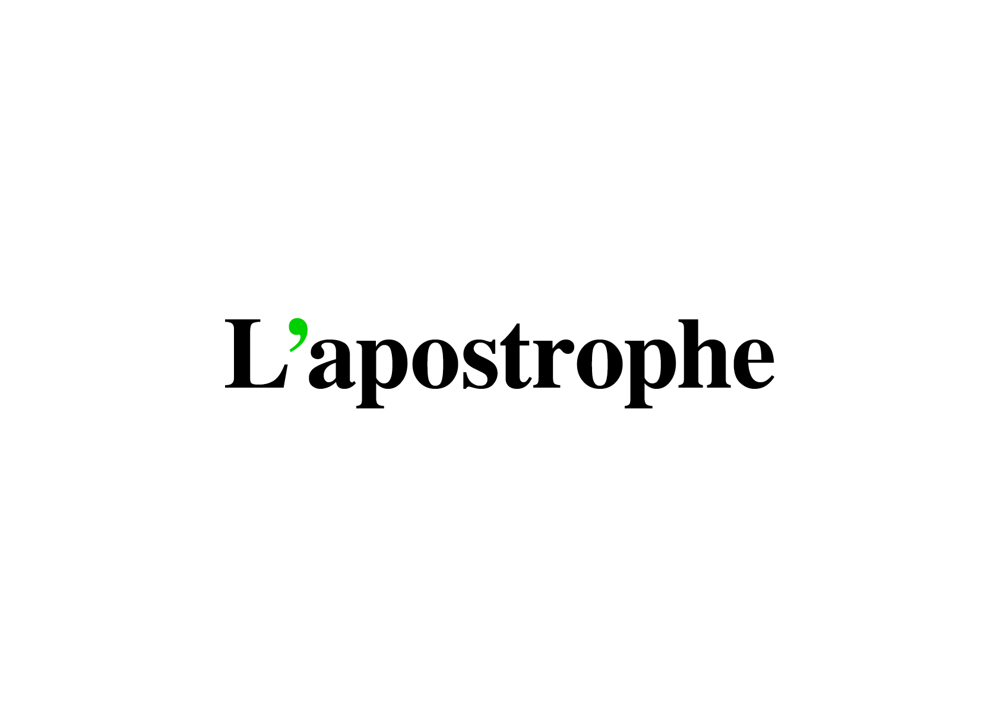
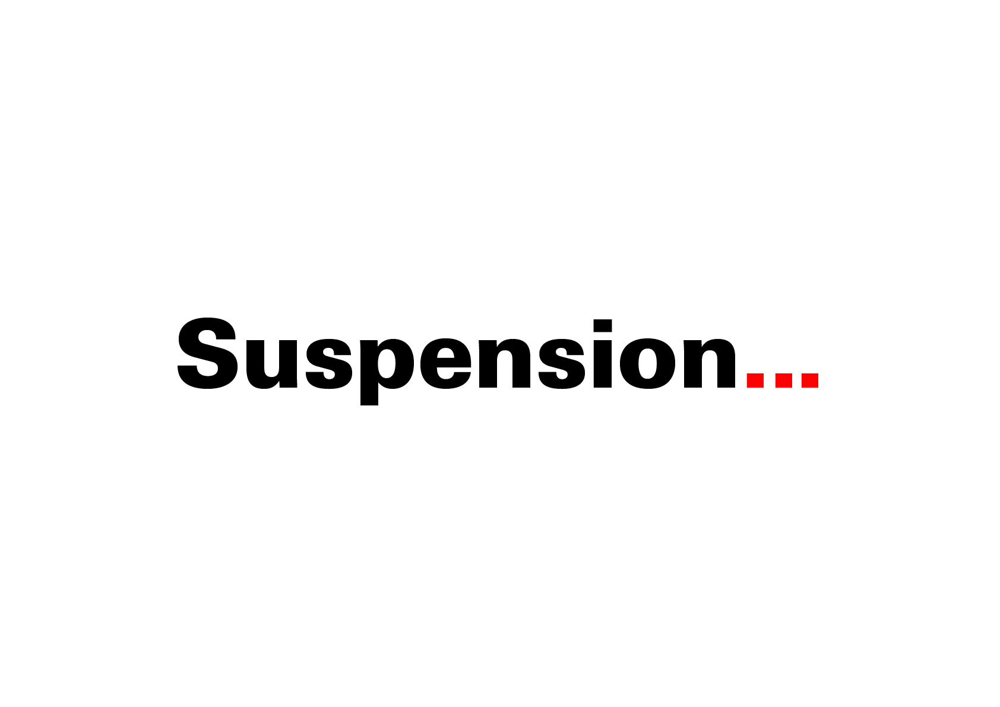
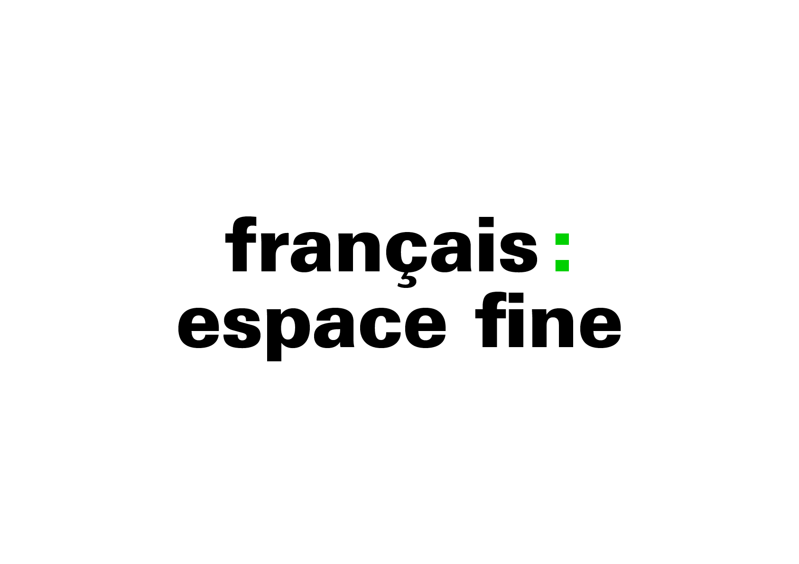
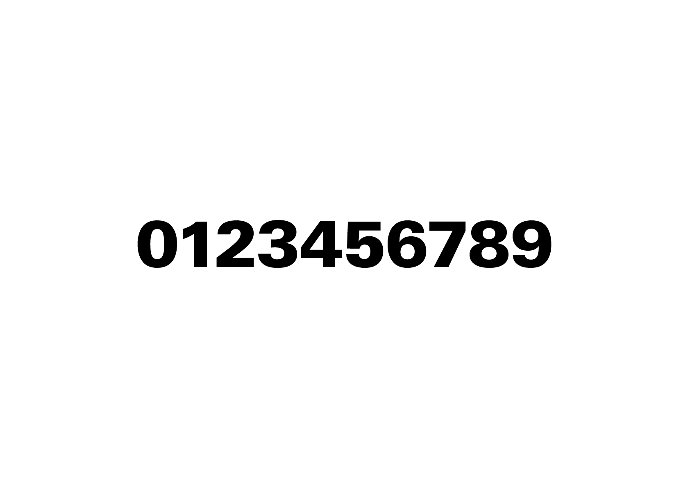
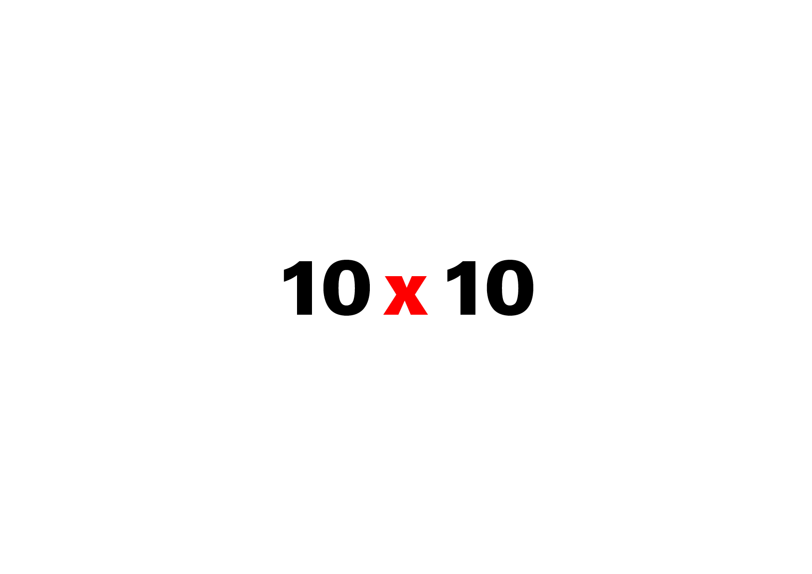
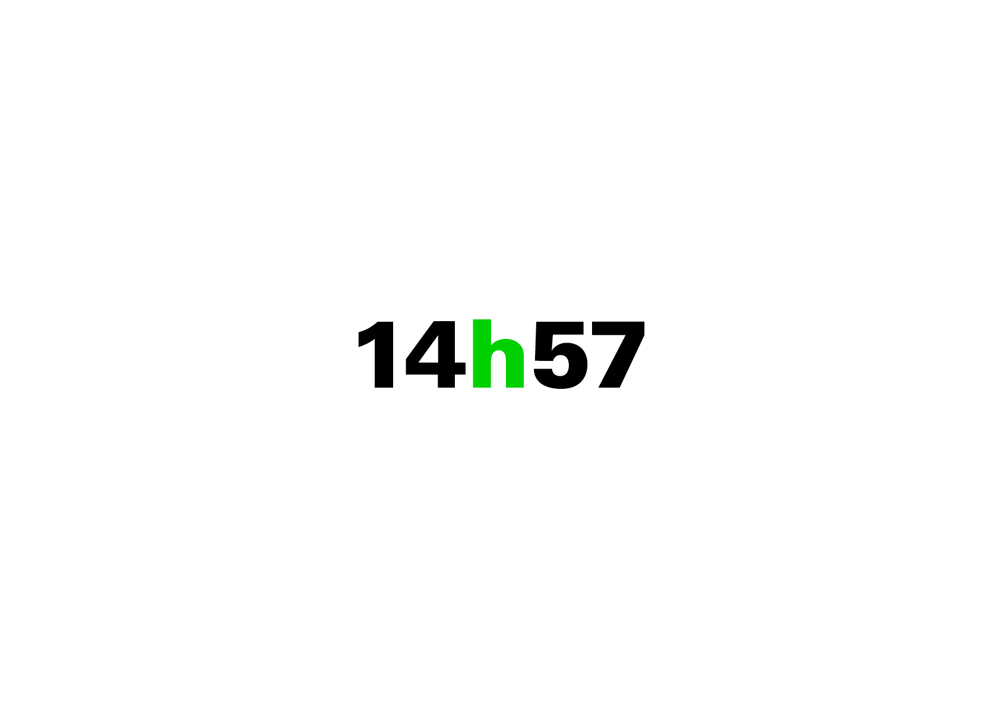
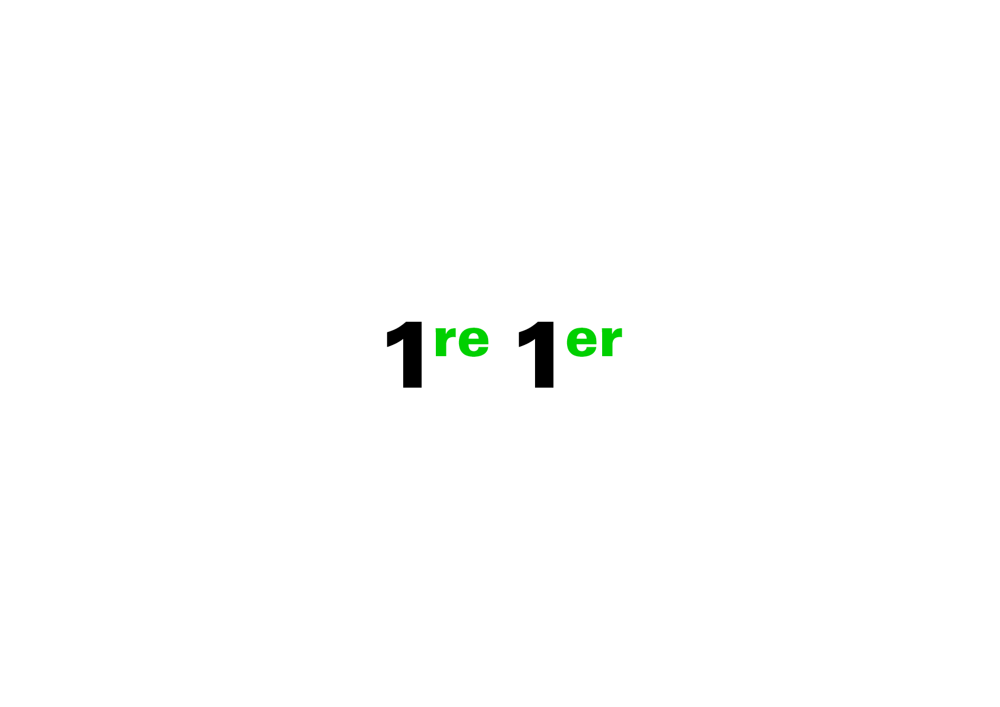

# 🔍 *Set a typeface*
  Micro et macro typographie

  
### &nbsp;

| |
|:---:|
| Power of Ten: un film qui traite de la taille relative des choses dans l’univers[^1]           |

# 🥂 Micro & Macro

| |
|:---:|
| Contenu = Séquence de texte, Contenant = Mise en forme  
(référence au ***Crystal Goblet*** de Beatrice Warde[^2])           |

# 🦠 Micro

La micro-typographie (contenu) concerne les symboles et les espaces dans la séquence de texte.

###  Le point, la virgule

| |
|:---:|
| Abc          |

###  L’apostrophe

| |
|:---:|
| Abc          |

###  Les points de suspension

| |
|:---:|
| Abc          |

###  La ponctuation

| |
|:---:|
| Abc          |

###  Les guillemets

| |
|:---:|
| Abc          |

###  Les césures

| |
|:---:|
| Abc          |

###  Les parenthèses, les tirets

| |
|:---:|
| Abc          |

###  Les chiffres

| |
|:---:|
| Abc          |

###  Les opérations

| |
|:---:|
| Abc          |

###  Les nombres

| |
|:---:|
| Abc          |

###  Les heures

| |
|:---:|
| Abc          |

###  Les index

| |
|:---:|
| Abc          |

# 🌏 Macro

La macro-typographie (contenant) concerne la mise en forme de la séquence de texte.

###  La police

###  Le corps

###  La justification

###  L’hyphénation

###  L’interligne

###  L’intermot

###  L’interlettre

# 🚨 Langue

Pour chaque langue il y a des conventions particulières, voici les ouvrages de références:

**Français CH**  
Guide du typographe romand

**Français FR**  
Lexique des règles en usage à l’Imprimerie nationale

**Allemand DE**  
Detail Typografie, Nachschlagewerk für alle Fragen zu Schrift und Satz

**Anglais UK**  
Hart’s Rules for Compositors and Readers at the University Press Oxford

**Anglais US**  
Chicago Manual of Style