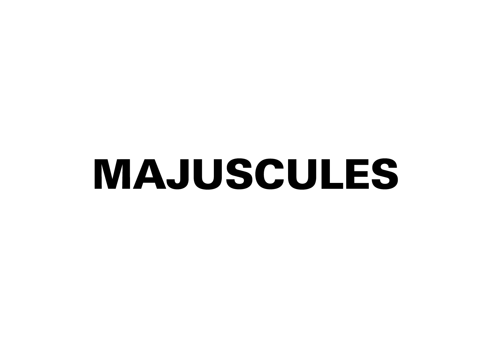
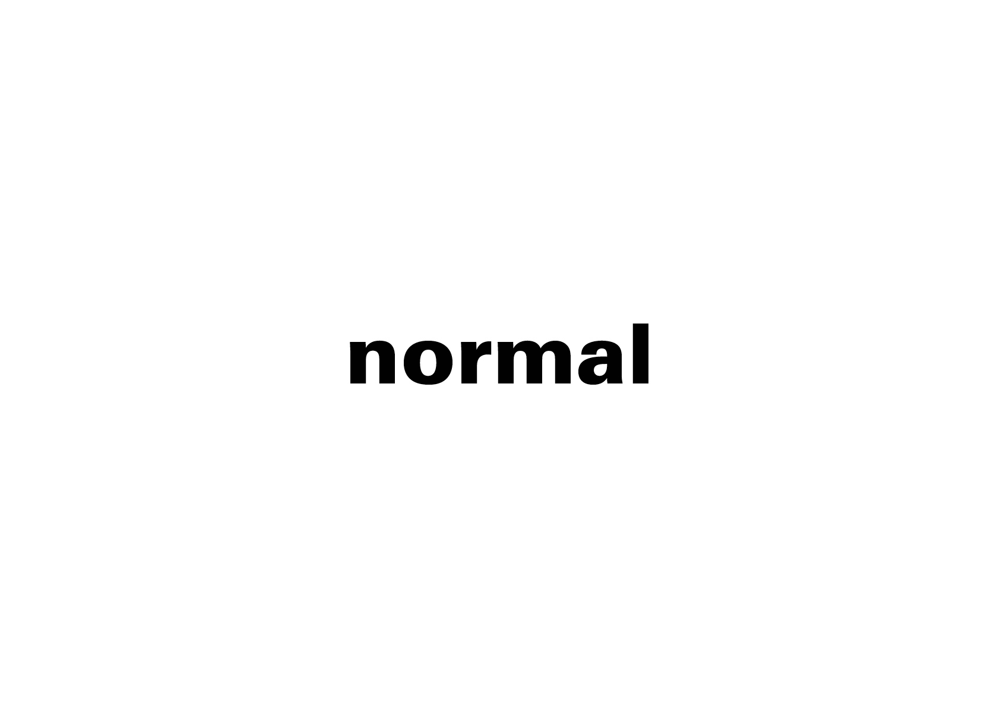

# 🔡 Graphie du mot

La graphie désigne la manière dont un mot est écrit. Les mots sont des combinaisons de lettres dont la séquence est fixée par des règles orthographiques. Pourtant, il existe une multitude de façons de transmettre le même message selon la graphie choisie. Chaque variante typographique suscite des perceptions différentes chez le lecteur.

→ La graphie du mot correspond à la mélodie
  
&nbsp;

# Casse  

| |
|:---:|
| L’usage des majuscules et des minuscules permet de hiérarchiser les mots, de marquer leur importance ou de donner une tonalité particulière au texte. |

# Ponctuation  

| |
|:---:|
| La ponctuation ne sert pas seulement à structurer et rythmer la lecture : elle permet aussi de nuancer le sens et de transmettre des émotions. |

### Sources

<!-- - **Prénom Nom**  
  *Titre*, 0000 -->

<!-- [^1]: Adrian Frutiger, *Type, Sign, Symbol*, 1980 -->

