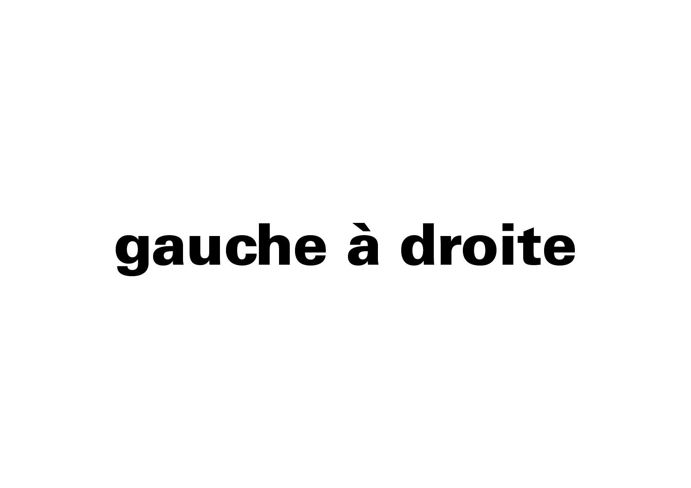
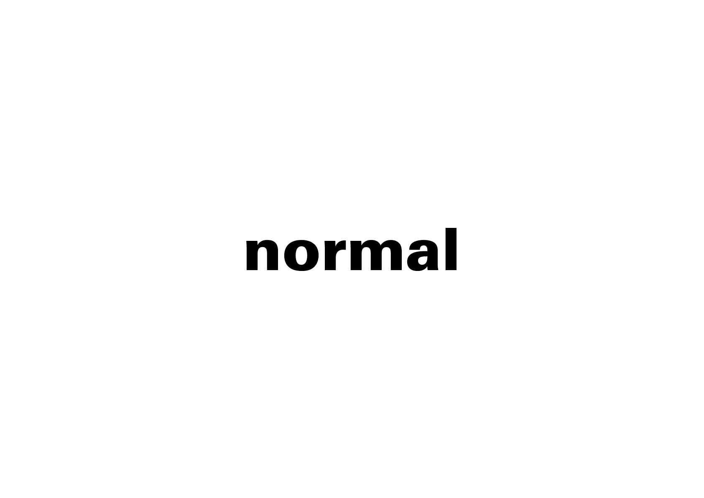

# ↔️ Composition du mot

La composition du mot se réfère à l’organisation globale de ses lettres dans l’espace. Elle détermine le rythme visuel et la cohérence d’ensemble dans la lecture. En fonction du caractère choisi, les intervalles horizontales et verticales doivent être adaptées.

→ Le rythme dans la parole correspond à l’arrangement spatial dans l’écrit
  
### &nbsp;

# Direction  

| |
|:---:|
| En typographie occidentale, le sens de lecture se fait de gauche à droite et de haut en bas, mais il existe d'autres systèmes  |

# Inter-lettrage  

| |
|:---:|
| L’ajustement de l’espacement des lettres doit trouver un équilibre entre lisibilité et impact graphique |

### Sources

- Karl Gerstner, *Kompendium für Alphabeten: Systematik der Schrift*, Sulgen/Frankfurt: Arthur Niggli, 1972 
- Ruedi Rüegg, *Basic Typography: Design with Letters / Typografische Grundlagen mit Schrift*, Zurich: Delta & Spes, 1980  
- Jost Hochuli, *Le détail en typographie*, London: Hyphen Press, 2005 [éd. orig. 1987]  
