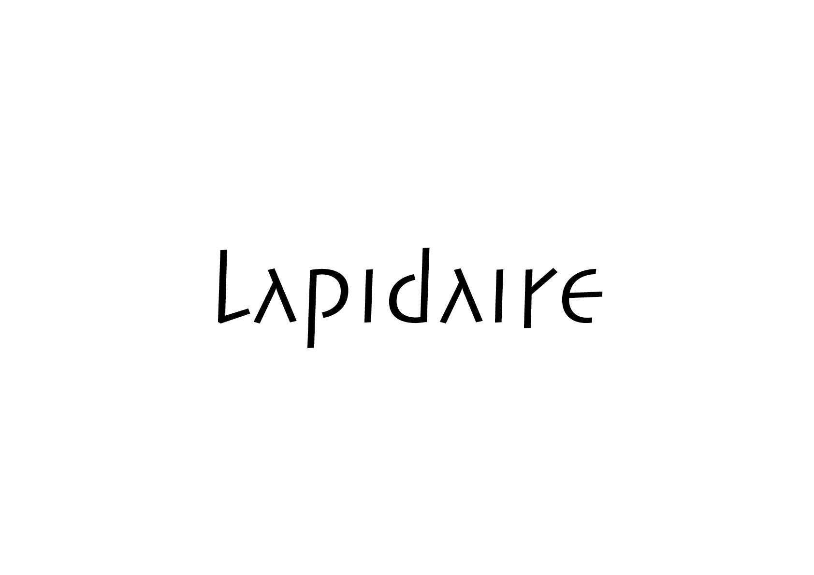

# 🔈 Texture du mot

La texture du mot fait référence aux formes de lettre choisies pour véhiculer le message. Les facteurs à prendre en considération dans le choix d'une police (en fonction du contexte d'utilisation) sont la lisibilité du caractère, l'étendue de la famille et du jeu de caractères, la technique de production ainsi que la connotation visuelle (valeur sémiotique).

→ Choisir un caractère équivaut à choisir un timbre de voix
  
&nbsp;

# Technique  

| |
|:---:|
| Chaque technique a ses limitations |

# Connotation  

| |
|:---:|
| Chaque caractère produit différentes émotions |

### Sources

<!-- - **Prénom Nom**  
  *Titre*, 0000 -->

<!-- [^1]: Adrian Frutiger, *Type, Sign, Symbol*, 1980 -->

