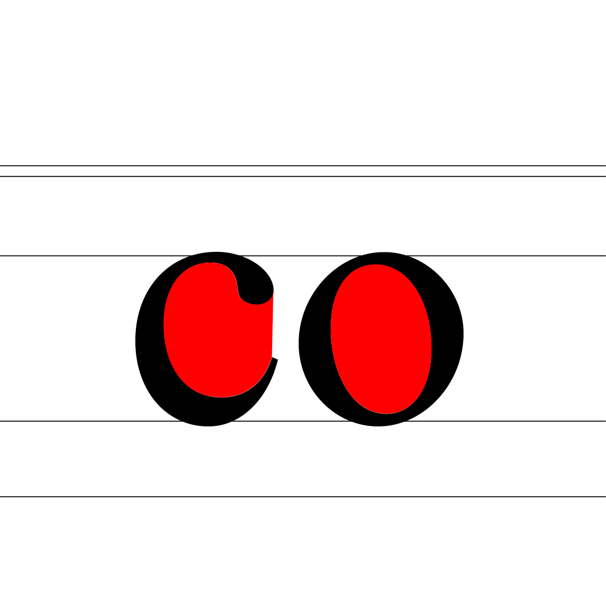

# 📏 Mesures du signe

  
###  

# Mesures verticales  

| |
|:---:|
| Abc | 
| |
|:---:|
| Abc | 
| |
|:---:|
| Abc | 
| |
|:---:|
| Abc | 
| |
|:---:|
| Abc | 
| |
|:---:|
| Abc | 
| |
|:---:|
| Abc | 
| |
|:---:|
| Abc | 
| |
|:---:|
| Abc | 

# Mesures horizontales  

| |
|:---:|
| Abc | 
| |
|:---:|
| Abc | 
| |
|:---:|
| Abc | 
| |
|:---:|
| Abc | 

# Mesures de surfaces  

| |
|:---:|
| Abc | 
| |
|:---:|
| Abc | 
| |
|:---:|
| Abc | 
| |
|:---:|
| Abc | 
| |
|:---:|
| Abc |

# ???  

| |
|:---:|
| Abc | 
| |
|:---:|
| Abc |

### Sources

<!-- - **Prénom Nom**  
  *Titre*, 0000 -->

<!-- [^1]: Adrian Frutiger, *Type, Sign, Symbol*, 1980 -->

