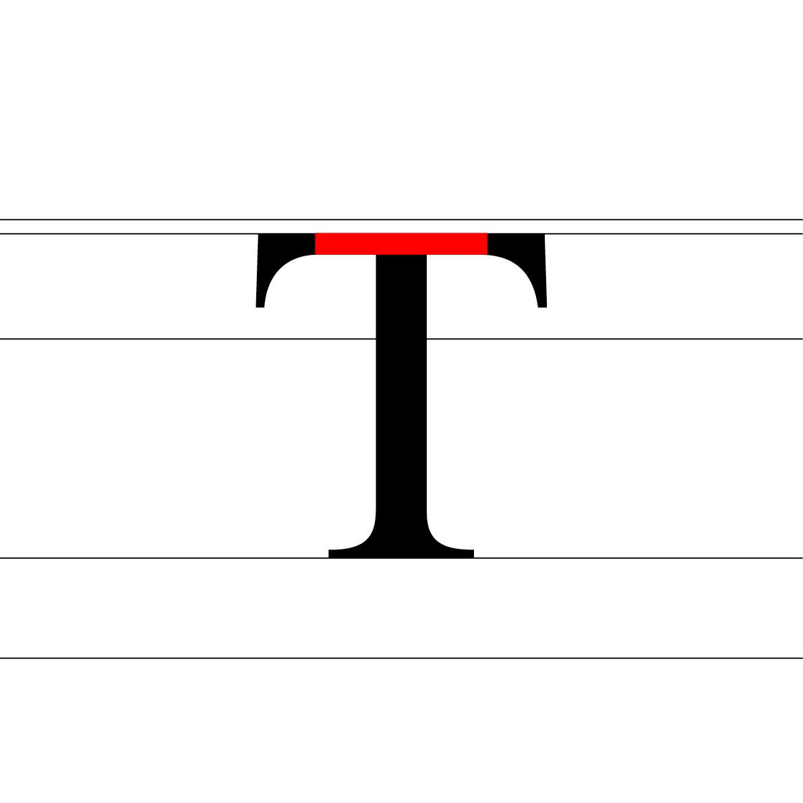

# ↕️ Mesures du caractère

- [Mesures verticales](#mesures-verticales)
- [Mesures horizontales](#mesures-horizontales)
- [Surfaces](#surfaces)
- [Casse](#casse)
- [Morphologie](#morphologie)

### &nbsp;

# Mesures verticales {#mesures-verticales}

| |
|:---:|
| Les mesures verticales, héritées de la typographie en plomb où toutes les lettres partageaient la même hauteur de corps, définissent les repères de base qui structurent l’empilement du texte. | 

### Ligne de pied {#ligne-de-pied}

| |
|:---:|
| La ligne de base (ou de pied) est la ligne sur laquelle reposent toutes les lettres. C’est le repère principal pour l’alignement des caractères         |

### Hauteur de x {#hauteur-de-x}

| |
|:---:|
| La hauteur de x correspond à la hauteur des lettres minuscules sans ascendantes ni descendantes, tel que le « x »            |

### Hauteur des capitales {#hauteur-des-capitales}

| |
|:---:|
| La hauteur des capitales est la hauteur des lettres majuscules, qui est normalement plus haute que celle des minuscules           |

### Hauteur des ascendantes {#hauteur-des-ascendantes}

| |
|:---:|
| La hauteur des ascendantes est la distance des parties de lettres minuscules qui s’élèvent au-dessus de la hauteur de x. Elle peut être égale ou inférieure à la hauteur des capitales           |

### Hauteur des descendantes {#hauteur-des-descendantes}

| |
|:---:|
| La hauteur des descendantes est la distance entre la ligne de base et le point le plus bas des parties de lettres qui descendent en dessous de celle-ci           |

<!-- ### surplus vertical?

| |
|:---:|
| Abc |  -->

### Corps {#corps}

| |
|:---:|
| Le corps est la taille totale de la police de caractères, mesurée de la ligne la plus basse à la ligne la plus haute comprises dans les mesures verticales           |

### Carre cadratin {#carre-cadratin}

| |
|:---:|
| Le carré cadratin (em square) est une unité de référence qui représente un carré imaginaire dont chaque côté mesure la taille du corps de la police           |

# Mesures horizontales {#mesures-horizontales}

| |
|:---:|
| Les mesures horizontales, elles aussi issues du plomb typographique, déterminent l’enchâssement des lettres sur la ligne | 

### Chasse {#chasse}

| |
|:---:|
| La chasse est la largeur totale occupée par un caractère, incluant l’espace autour du caractère lui-même           |

### Espacement (spacing) {#espacement-spacing}

| |
|:---:|
| L’espacement désigne la gestion des espaces autour d’un caractère au sein même de sa chasse           |

### Crenage (kerning) {#crenage-kerning}

| |
|:---:|
| Le crénage désigne la gestion de l’espace entre certaines paires de lettres pour en améliorer l’harmonie visuelle           |

# Surfaces {#surfaces}

| |
|:---:|
| Le signe est composé d'une organisation de surfaces noires et blanches | 

### Pleins & delies {#pleins--delies}

| |
|:---:|
| Les pleins sont les parties plus épaisses des caractères, tandis que les déliés sont les parties plus fines           |

### Fut {#fut}

| |
|:---:|
| Le fût est la partie verticale rectiligne d’une lettre, généralement de valeur identique à travers les minuscules et les majuscules           |

### Traverse {#traverse}

| |
|:---:|
| La traverse est la partie horizontale rectiligne qui traverse une lettre           |

### Contre-forme {#contre-forme}

| |
|:---:|
| La contre-forme désigne les espaces vides à l’intérieur d’une lettre, elles peuvent être ouvertes ou fermées           |

### Espace blanc {#espace-blanc}

| |
|:---:|
| L’espace blanc est crucial pour la lisibilité et l’esthétique générale d’un caractère car il permet de distinguer les caractères et de créer un contraste visuel avec le fond           |

# Casse {#casse}

| |
|:---:|
| Le terme «casse» provient de la caisse en bois où les lettres étaient rangées par catégories: majuscules en haut et minuscules en bas | 

### Bas de casse {#bas-de-casse}

| |
|:---:|
| Le terme « bas de casse » fait référence aux lettres minuscules           |

### Capitales {#capitales}

| |
|:---:|
| Le terme « capitales » fait référence aux lettres majuscules           |

# Morphologie {#morphologie}

| |
|:---:|
| La terminologie des parties des signes découle de la une tendance humaine à tout anthropomorphiser | 

### Oeil {#oeil}

| |
|:---:|
| L’œil désigne la partie intérieure fermée d’une lettre comme le « e » ou le « o »           |

### Oreille {#oreille}

| |
|:---:|
| L’oreille est une extension qui se trouve sur certaines lettres comme le « g »           |

### Epaule {#epaule}

| |
|:---:|
| L’épaule fait référence à la partie arrondie d’une lettre qui connecte souvent un fût à une courbe, comme dans le « h », le « m » ou le « n »           |

### Panse {#panse}

| |
|:---:|
| La panse désigne la partie arrondie d’une lettre, généralement dans les lettres comme le « b », le « d » ou le « p »           |

### Colonne {#colonne}

| |
|:---:|
| La colonne est la zone médiane qui relie les courbes et donne à la lettre sa structure générale           |

### Bras {#bras}

| |
|:---:|
| Le bras est une partie horizontale d’une lettre qui ne touche pas la ligne de base, comme dans le « T » ou le « E »           |

### Jambe {#jambe}

| |
|:---:|
| La jambe est la partie d’une lettre qui descend vers la ligne de base à partir d’un trait fût, comme dans le « k » ou le « r »           |

### Pied {#pied}

| |
|:---:|
| Le pied est la partie inférieure d’une lettre qui repose sur la ligne de base, comme dans le « R » ou le « A »           |

### Queue {#queue}

| |
|:---:|
| La queue est une extension qui s’étend en dehors de la lettre, comme dans le « Q » ou le « J »           |

### Sources

- Jost Hochuli, *Le détail en typographie*, London: Hyphen Press, 2005 [éd. orig. 1987]  
- Ruedi Rüegg, *Basic Typography: Design with Letters / Typografische Grundlagen mit Schrift*, Zurich: Delta & Spes, 1980 
