# 🔼 Optique du caractère

- [Illusion](#illusion)
- [Illusion de proportions](#illusion-de-proportions)
  - [Carré](#carre)
  - [Rond](#rond)
  - [Diagonale](#diagonale)
- [Illusion de dimensions](#illusion-de-dimensions)
  - [Courbes](#courbes)
  - [Pointes](#pointes)
- [Illusion de contraste](#illusion-de-contraste)
- [Illusion de position](#illusion-de-position)
  - [Alignement](#alignement)
  - [Espacement](#espacement)
- [Formes → Caractères](#formes--caracteres)
  
&nbsp;

# Illusion {#illusion}

|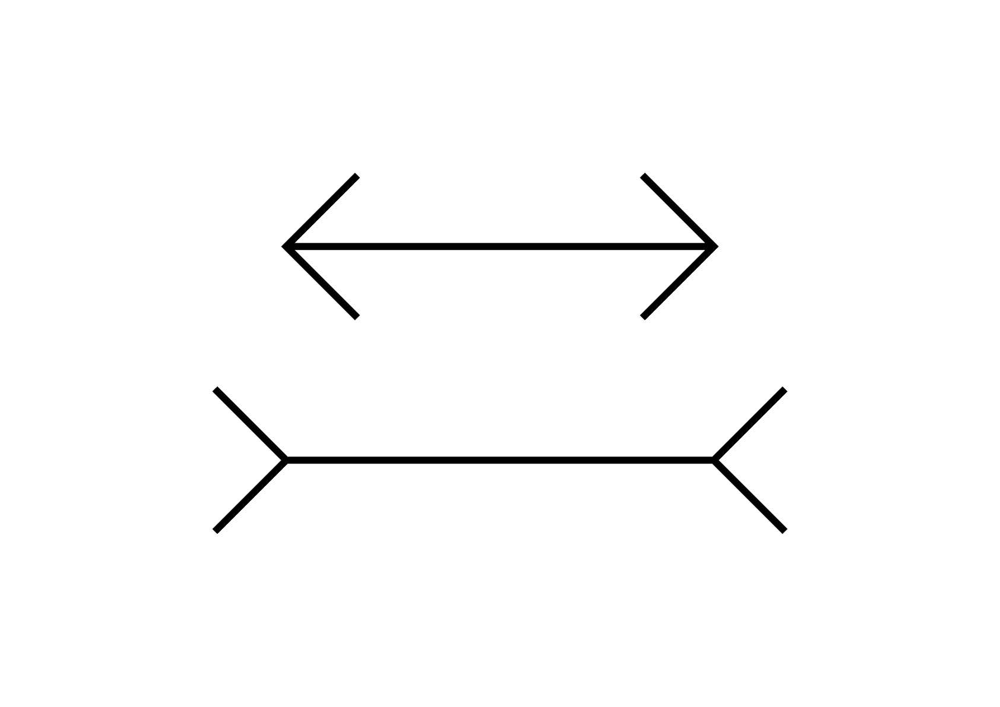 |
|:---:|
| Illusion de Müller-Lyer[^1] |

Notre esprit conçoit les formes différement de comment nos yeux les perçoivent. En effet, notre oeil perçoit les traits horizontaux comme étant plus épais qu'ils ne le sont en réalité. D'autre part, les horizontales paraîssent plus longues qu'elles ne le sont mathématiquement. Une partie du travail de conception des caractères consiste donc à gérer cette friction entre logique et optique.

# Illusion de proportions {#illusion-de-proportions}

|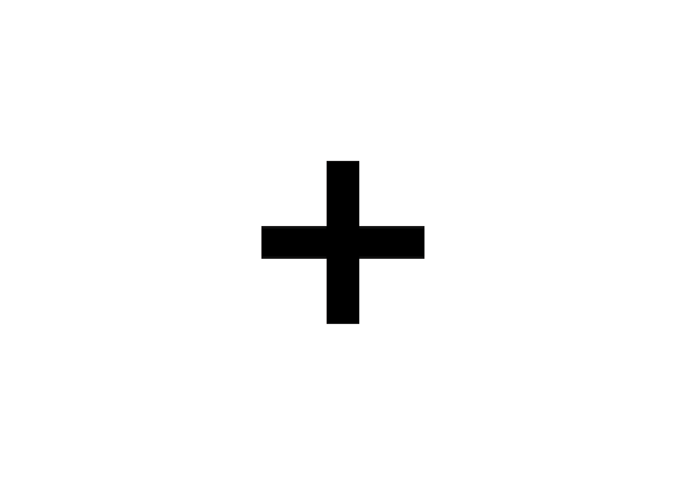 |
|:---:|
| Les traits horizontaux paraissent plus épaisses que les traits verticaux           |

## Carré {#carre}

|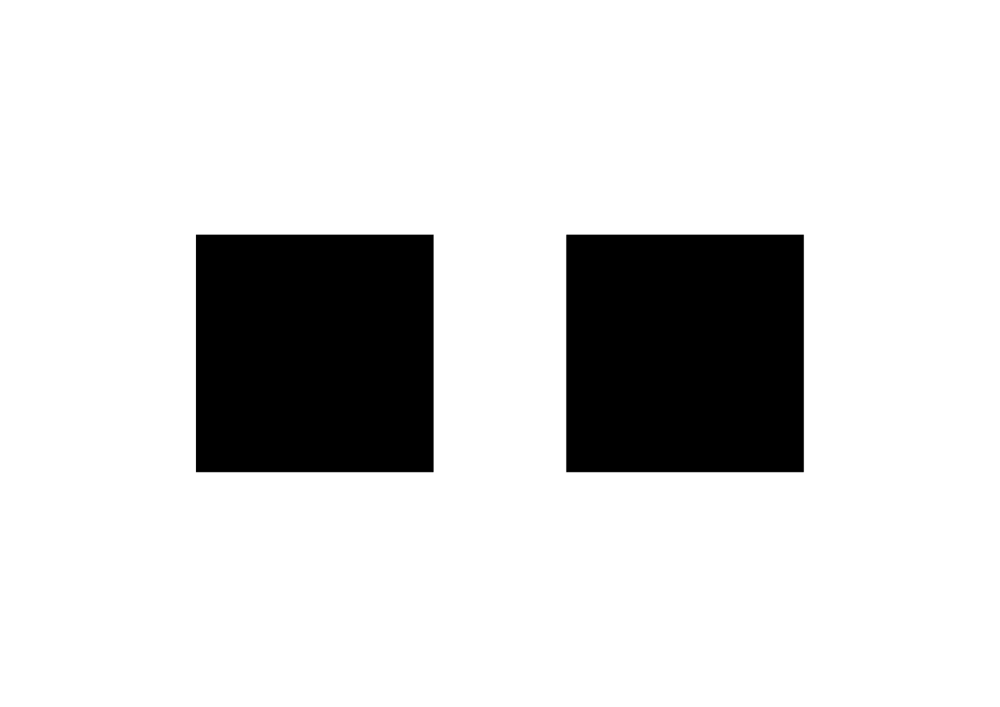 |
|:---:|
| Un carré mathématique paraît plus large que haut, il faut donc réduire sa largeur.           |

## Rond {#rond}

|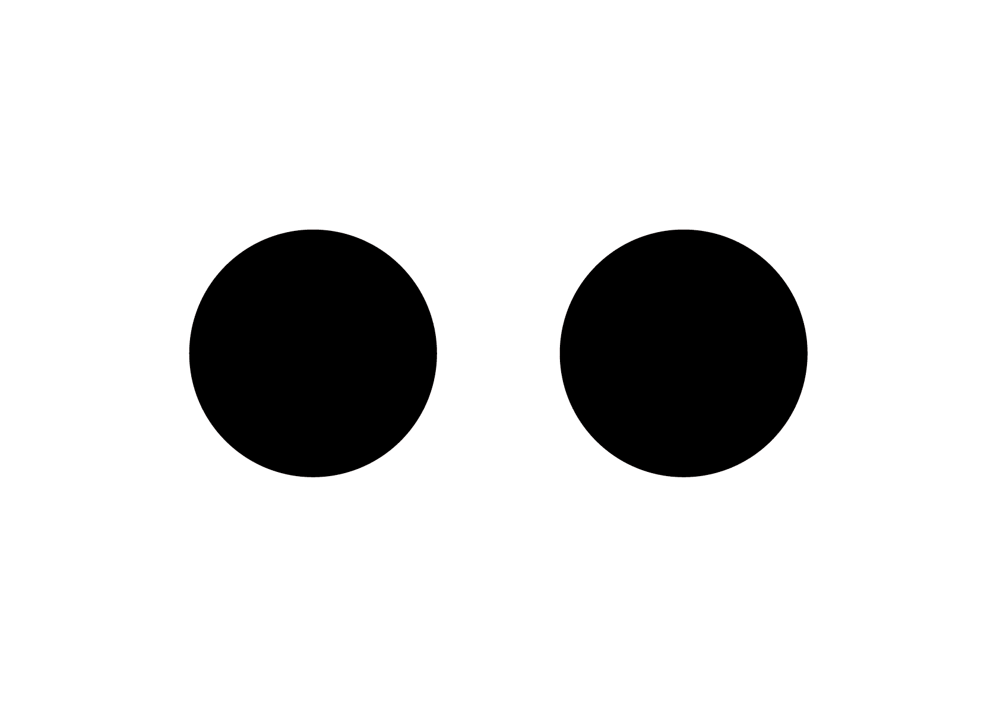 |
|:---:|
| Un rond mathématique paraît plus large que haut           |

## Diagonale {#diagonale}

|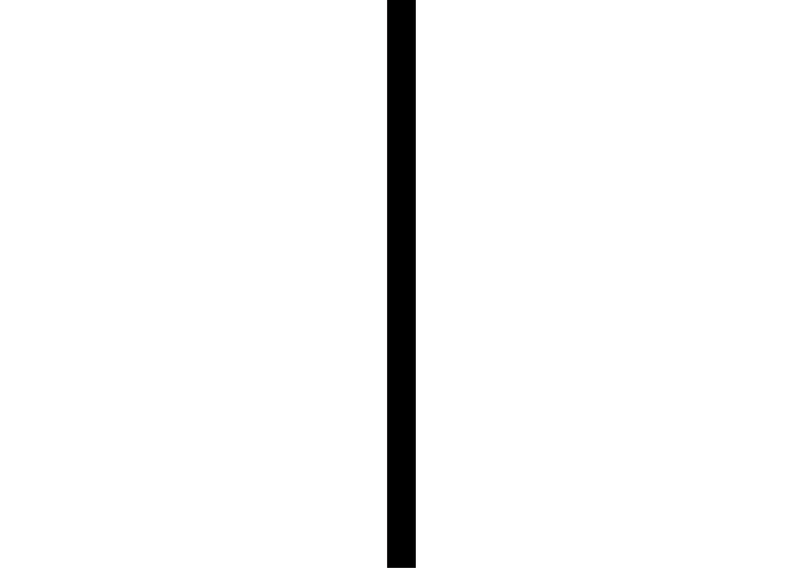 |
|:---:|
| Il faut donc compenser graduellement les traits diagonaux, plus le trait est horizontal, plus il faut le compenser           |

# Illusion de dimensions {#illusion-de-dimensions}

|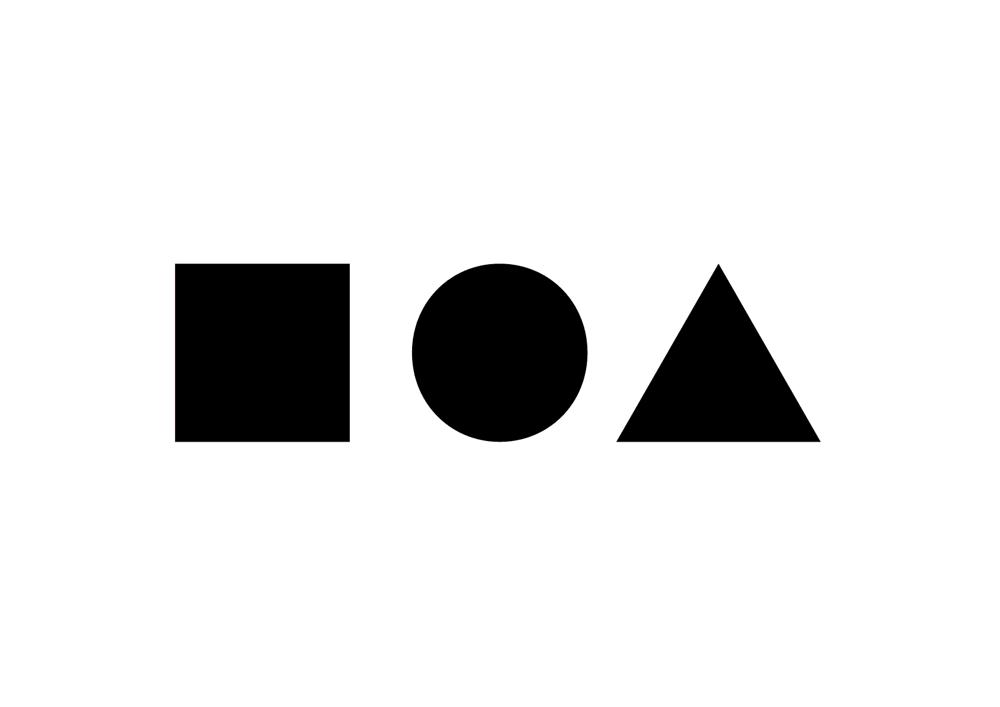 |
|:---:|
| À hauteur égale, le rond et le triangle paraissent plus petits que le carré            |

## Courbes {#courbes}

|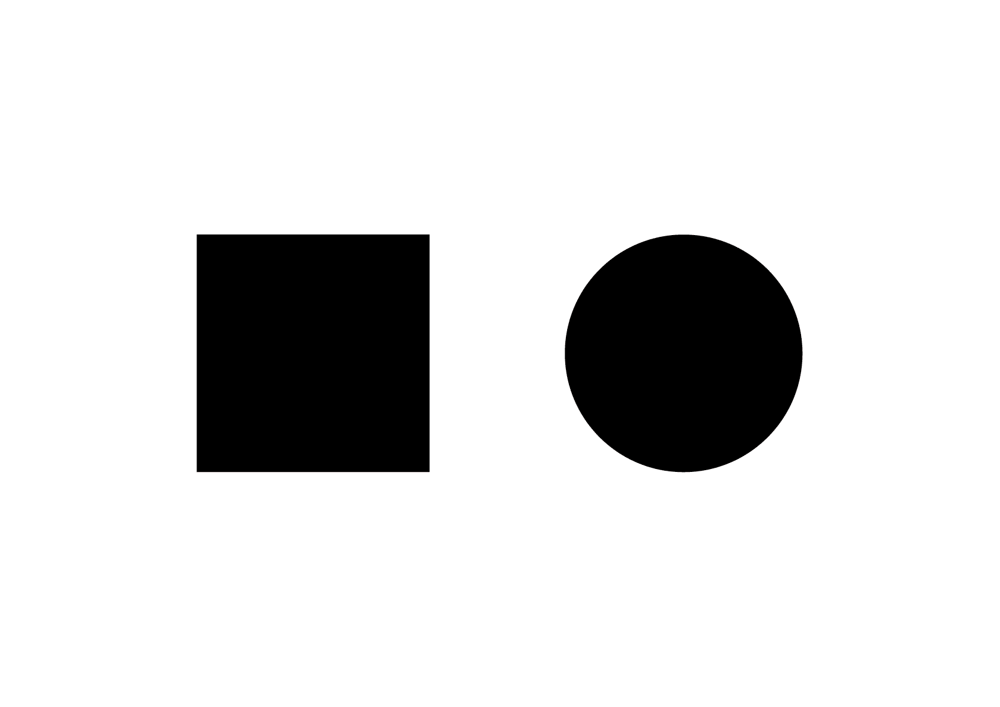 |
|:---:|
| Les courbes doivent doivent dépasser du carré (tout autour si c'est un cercle)        |

## Pointes {#pointes}

|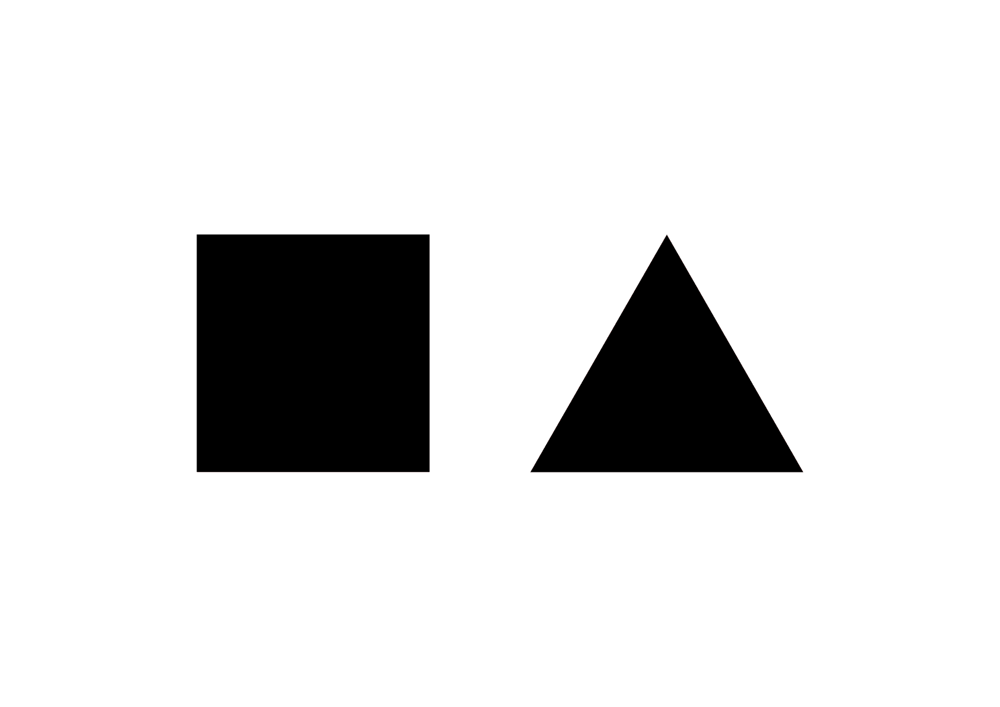 |
|:---:|
| Les pointes doivent dépasser, souvent plus que les courbes (seulement au niveau des angles)           |

# Illusion de contraste {#illusion-de-contraste}

|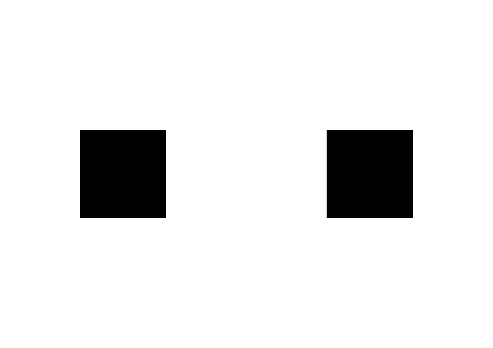 |
|:---:|
| Un carré de même taille en blanc sur noir paraît plus grand que en noir sur blanc           |

# Illusion de position {#illusion-de-position}

|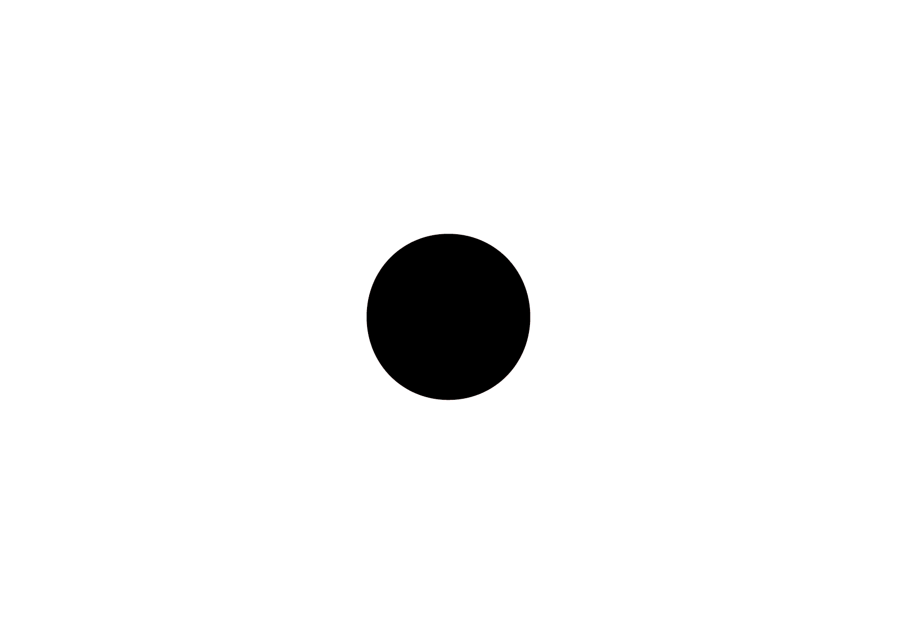 |
|:---:|
| Une forme placé au centre d'un format paraît trop basse, il faut donc la surélever pour qu'elle semble centrée. Une forme positionée en bas semble tomber. Inversément, placée en haut, elle semble s'envoler           |

## Alignement {#alignement}

|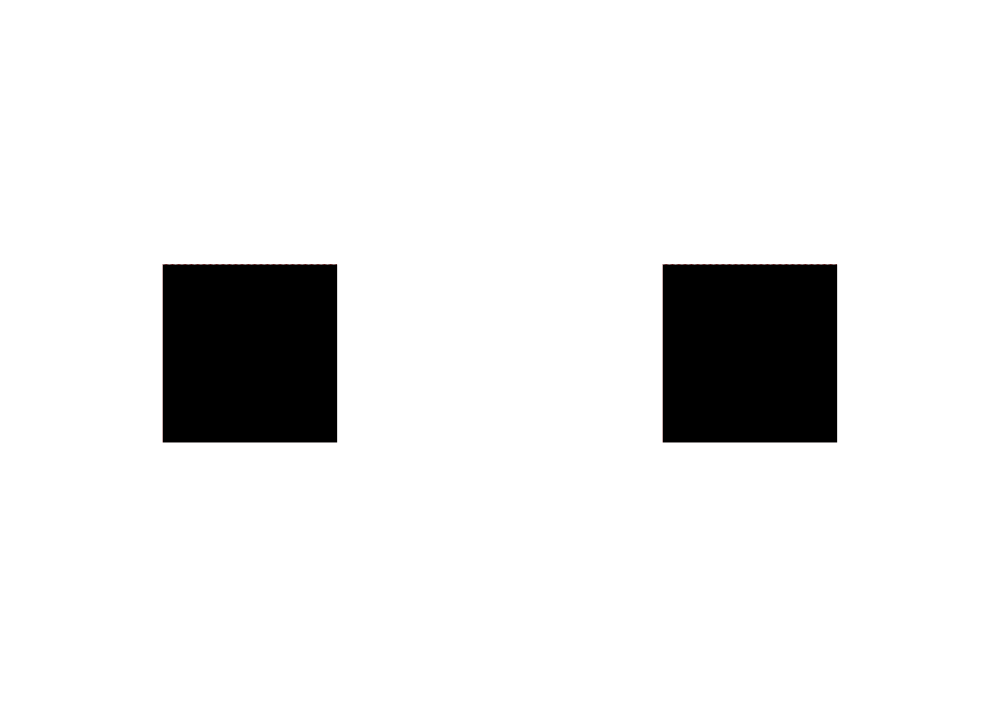 |
|:---:|
| Les formes ne sont pas alignées par rapport à leur centre mais par rapport à la ligne de base et aux différentes hauteurs (x, capitales). Le triangle s'aligne sur son côté droit, en fonction de son orientation soit sur la ligne de base soit sur la hauteur de x          |

## Espacement {#espacement}

|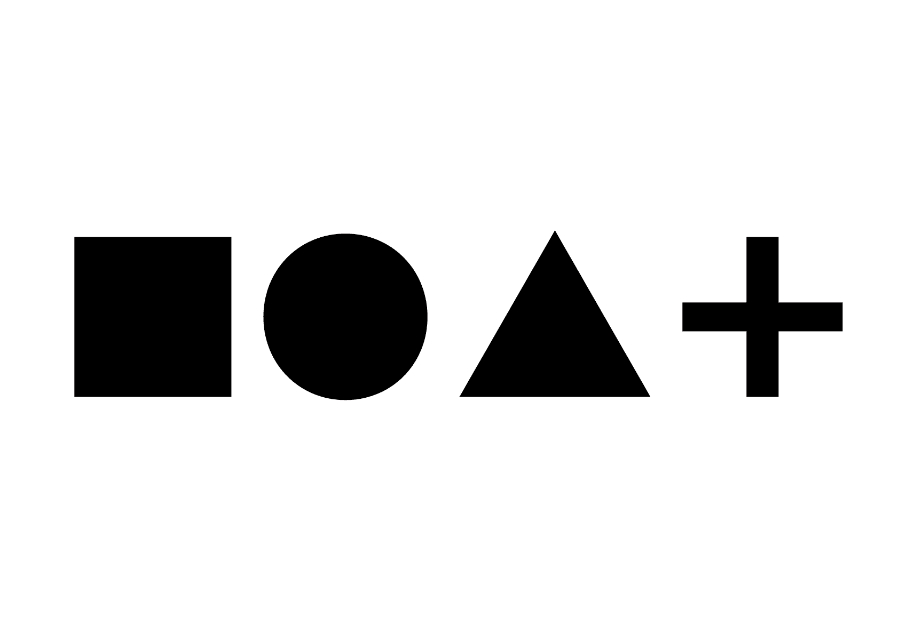 |
|:---:|
| Un espacement unique reporté entre les extrêmités des formes ne fonctionnent pas. Il faut plutôt visualiser un ballon rempli d’air (d'un volume unique) qui se déforme en fonction de l'espace disponible entre les formes.           |

|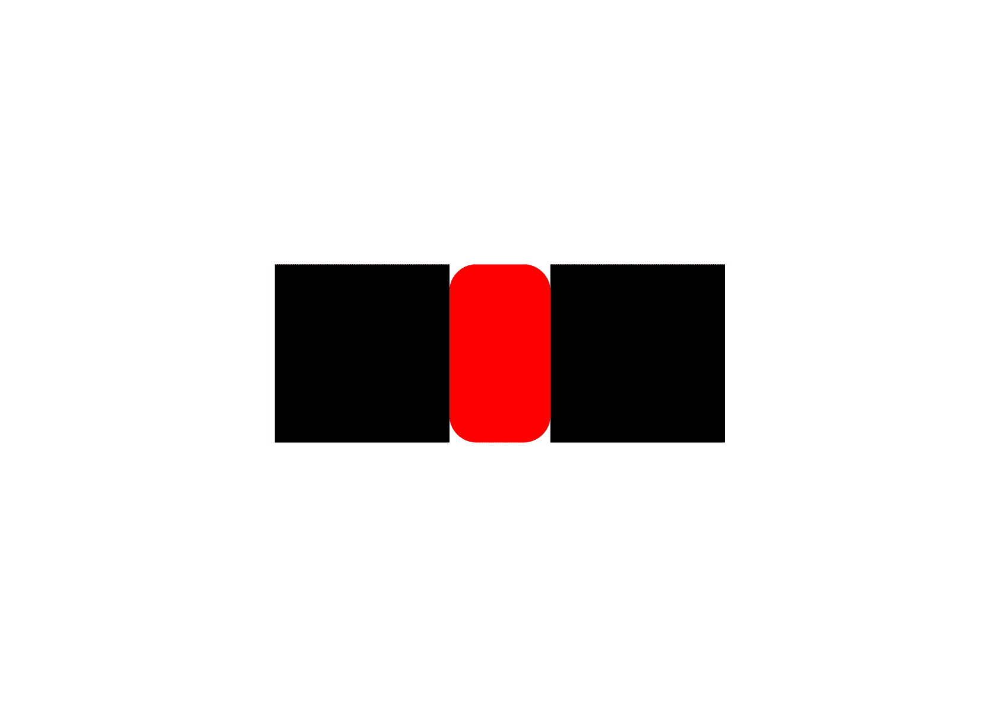 |
|:---:|
| De manière générale, plus la forme comporte une extrimité linéaire et vericale, plus l'espace sera grand. L’espacement devient de plus en plus petit: droite-droite, courbe-courbe, diagonale-diagonale, etc. Dans certains cas de formes complexes comme la croix, les formes peuvent se toucher ou se collisionner pour harmoniser l'espacer (crénage)          |

# Formes → Caractères {#formes--caracteres}

Les règles optiques qui s'appliquent aux formes primitives s'appliquent aussi aux caractères.

|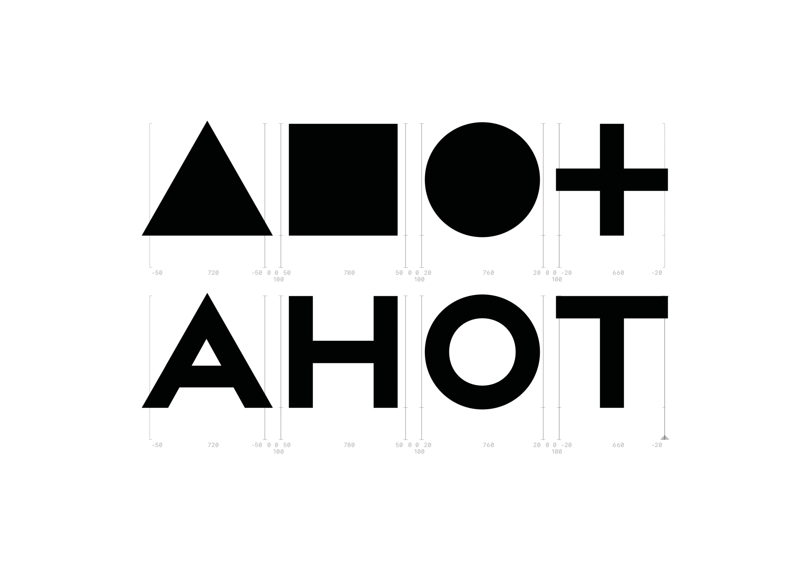 |
|:---:|
| Transposition des formes primaires aux caractères           |

### Sources

- Jost Hochuli, *Le détail en typographie*, London: Hyphen Press, 2005 [éd. orig. 1987]  
- Jonathan Hoefler, *Typographic Illusions*, www.typography.com  
- Anton Studer, *Is What I See What I Get? — Math & Optics in Type Design*, www.typographica.org  

[^1]: Franz Carl Müller-Lyer, *Müller-Lyer Illusion*, 1889

