# 🦴 Anatomie du signe

  
### &nbsp;

|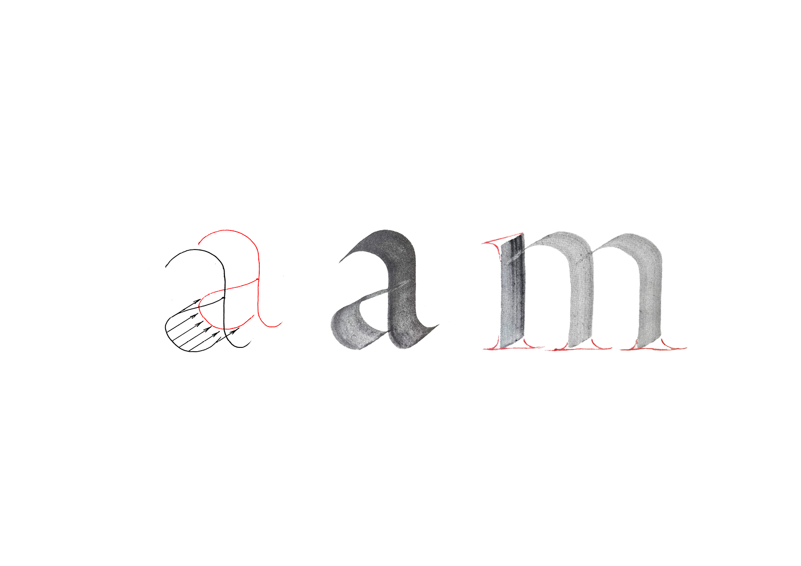 |
|:---:|
| Squelette - Graisse - Enveloppe | 

|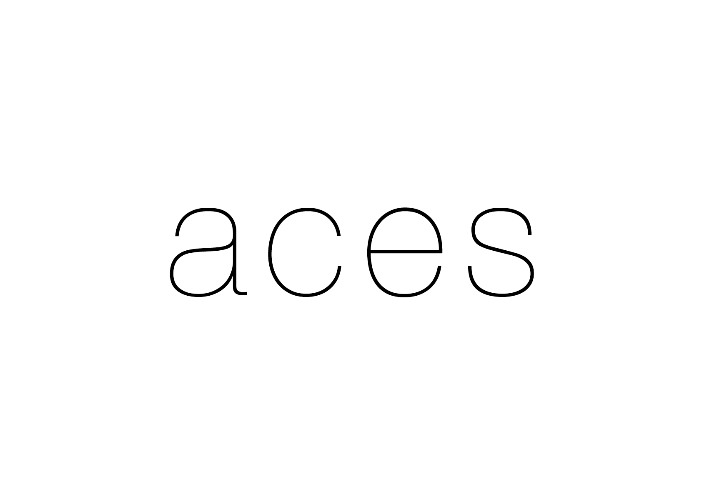 |
|:---:|
| Squelette - Graisse - Enveloppe | 

# Squelette

| 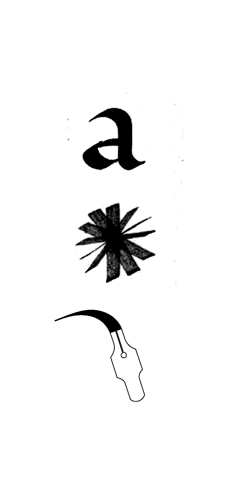 | 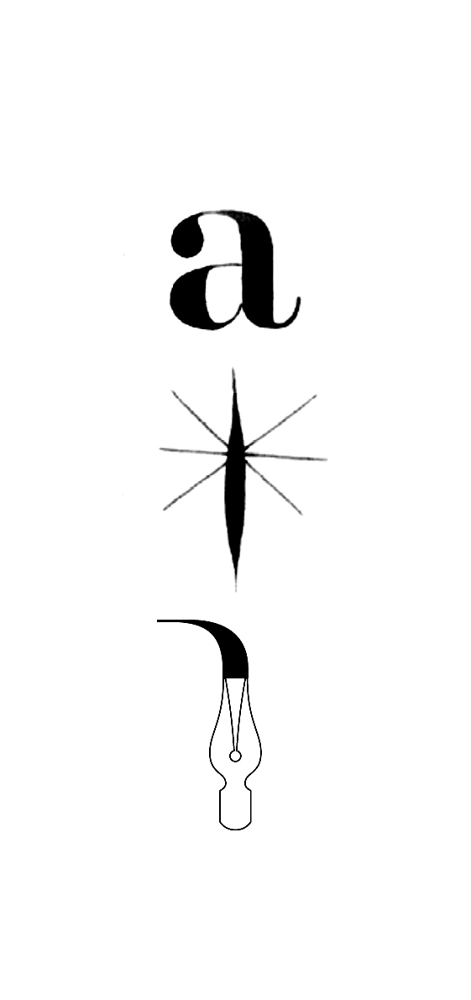 | 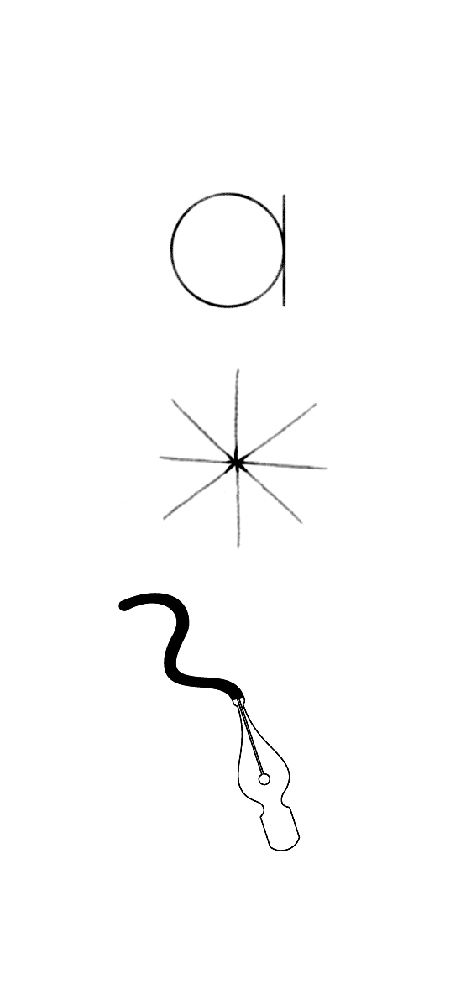 |
|:---:|:---:|:---:|
| Le principe dynamique découle historiquement de la calligraphie humaniste (Renaissance) réalisée à la plume à bec large. La tension diagonale ainsi que les terminaisons ouvertes des lettres résultent de la translation du bec carré, maintenu à un angle fixe.           | Le principe statique découle historiquement de la calligraphie moderne (Renaissance) réalisée à la plume à bec pointu. La tension verticale ainsi que les terminaisons fermées des lettres résultent de l’expansion du bec carré, qui évolue avec la pression de la main.           | Le principe géométrique découle historiquement du constructivisme post-moderne (XXe) réalisée à la plume à bec rond. La construction modulaire des lettres résultent du bec rond qui produit un contraste monolinéaire.           |

| 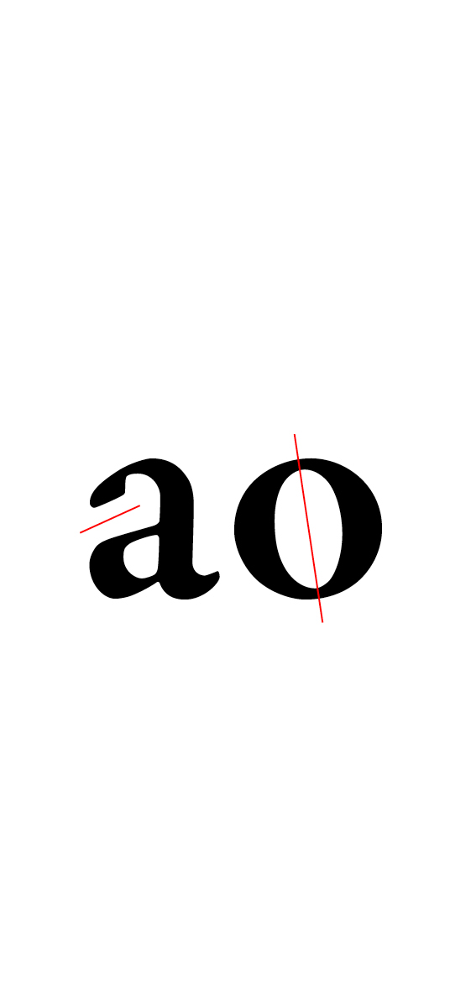 | 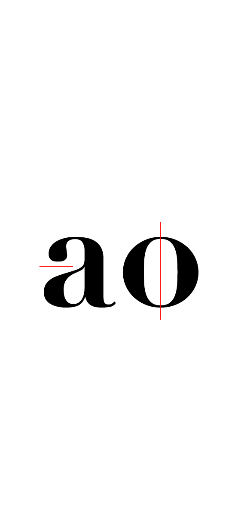 |  |
|:---:|:---:|:---:|
| Squelette dynamique           | Squelette statique           | Squelette géométrique           |

# Graisse

|  |  |
|:---:|:---:|
| Contrasté           | Linéaire           |

# Enveloppe

## Terminaisons

|  | 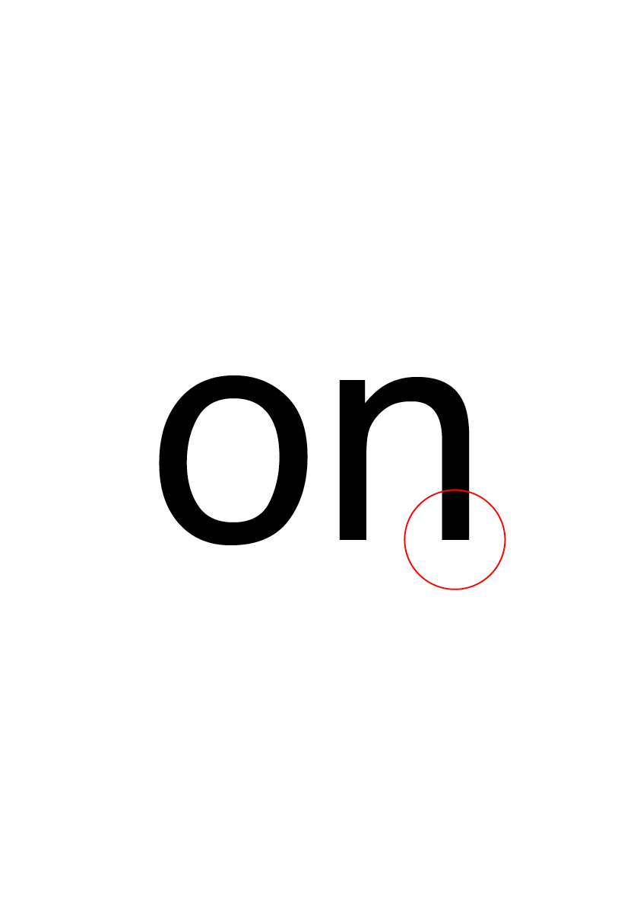 |
|:---:|:---:|
| Avec (empattements)           | Sans (empattements)           |

| 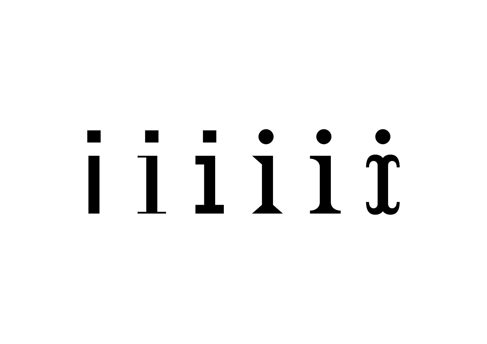 |
|:---:|
| Variation de la forme des empattements (sans, rectangulaire, triangulaire, transitionnel, intersection)           |

## Fûts

|  |  | 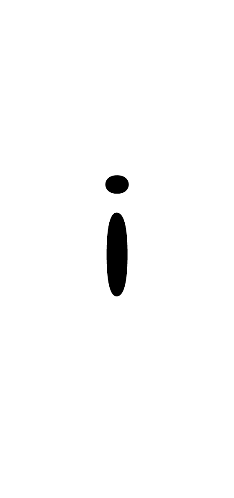 |
|:---:|:---:|:---:|
| Concaves           | Rectilignes           | Convexes           |

## Ouvertures

| 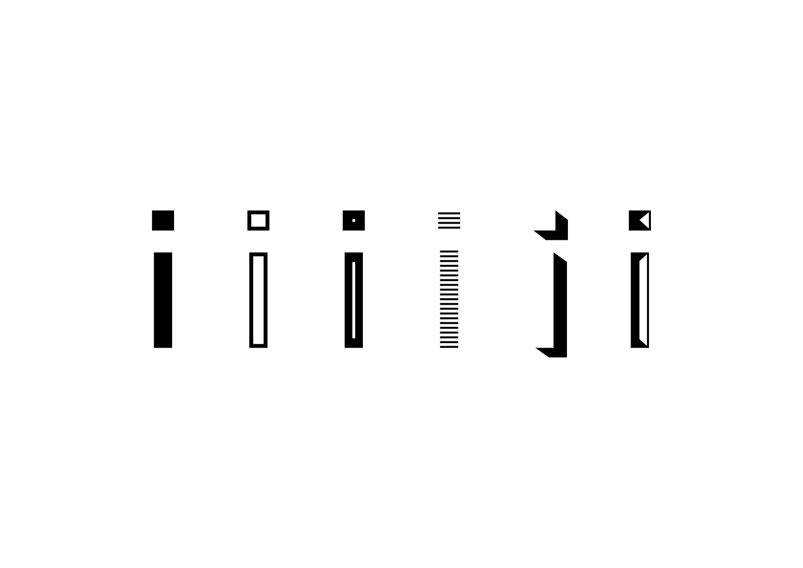 |
|:---:|
| Variation de l'effet général appliqué au dessin (outline, inline, hachure, ombre, gravure)           |
|  |
|:---:|
| Variation de l'effet général appliqué au dessin (outline, inline, hachure, ombre, gravure)           |
|  |
|:---:|
| Variation de l'effet général appliqué au dessin (outline, inline, hachure, ombre, gravure)           |

## Ornements

|  |
|:---:|
| Variation de l'effet général appliqué au dessin (outline, inline, hachure, ombre, gravure)           |

### Sources

<!-- - **Prénom Nom**  
  *Titre*, 0000 -->

<!-- [^1]: Adrian Frutiger, *Type, Sign, Symbol*, 1980 -->

