# 🦴 Anatomie du signe

  
### &nbsp;

| |
|:---:|
| Abc | 

| |
|:---:|
| Abc | 

## Principe[^2]

|  |  |  |
|:---:|:---:|:---:|
| Principe dynamique           | Principe statique           | Principe géométrique           |

|  |  |  |
|:---:|:---:|:---:|
| Principe dynamique           | Principe statique           | Principe géométrique           |

## Contraste

|  |  |
|:---:|:---:|
| Contrasté           | Linéaire           |

## Terminaisons

|  |  |
|:---:|:---:|
| Avec (empattements)           | Sans (empattements)           |

## 📐 Proportions

## Rapports

| 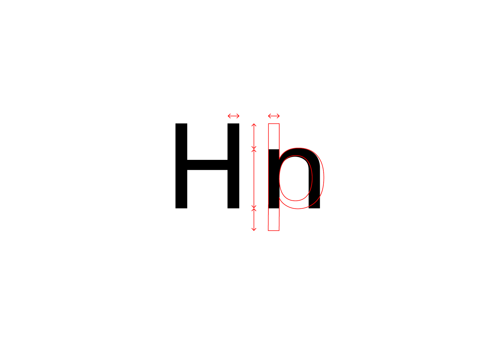 |
|:---:|
| Cohérence visuelle des fûts, des connexions, des ascendantes et descendantes           |

## Graisse

| 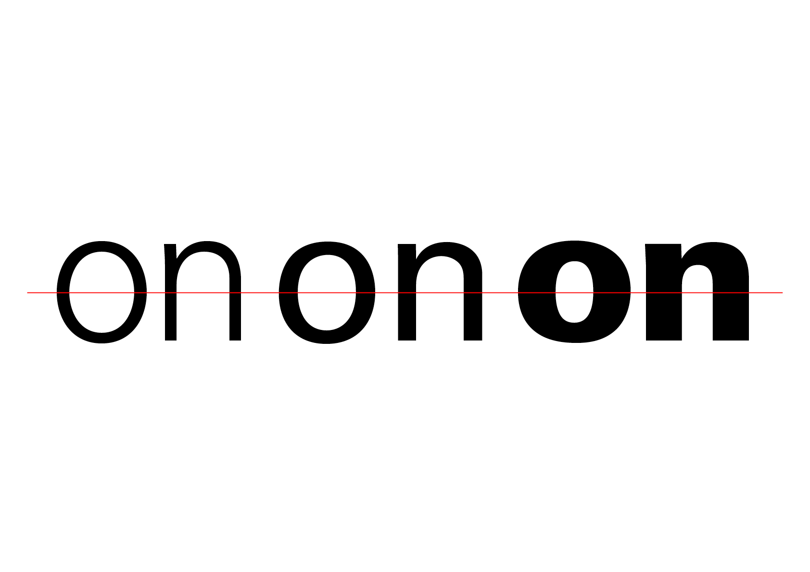 |
|:---:|
| L’épaisseur du tracé (light, regular, bold,…)           |

## Largeur

|  |
|:---:|
| La largeur des lettres (par rapport à la hauteur de x)           |

## Hauteur

|  |
|:---:|
| La hauteur des lettres (par rapport à la hauteur de x)           |

## Angle

| 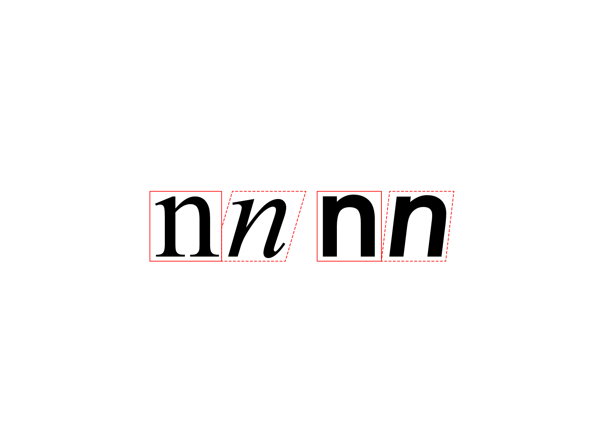 |
|:---:|
| L’angle des lettres, italique (cursive dessinée) ou slanted (mathématiquement penchée)           |

## 🗜️ Style

## Fûts

|  |  |  |
|:---:|:---:|:---:|
| Concaves           | Rectilignes           | Convexes           |

## Empattements

|  |
|:---:|
| Variation de la forme des empattements (sans, rectangulaire, triangulaire, transitionnel, intersection)           |

## Ornements

|  |
|:---:|
| Variation de l'effet général appliqué au dessin (outline, inline, hachure, ombre, gravure)           |

# Squelette  

|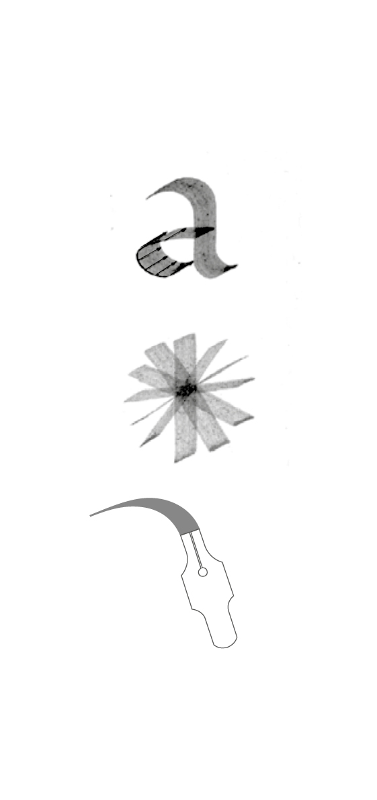 |
|:---:|
| Abc | 

|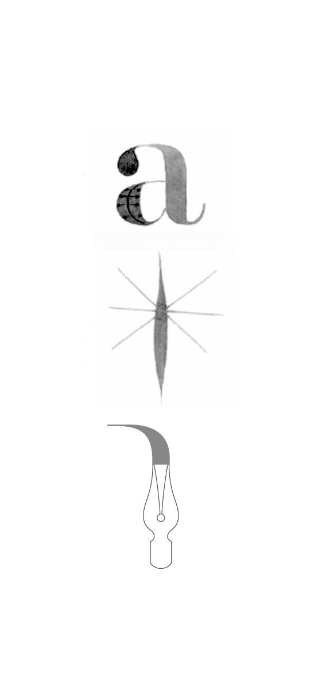 |
|:---:|
| Abc | 

|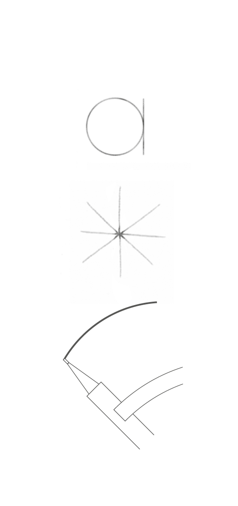 |
|:---:|
| Abc | 

|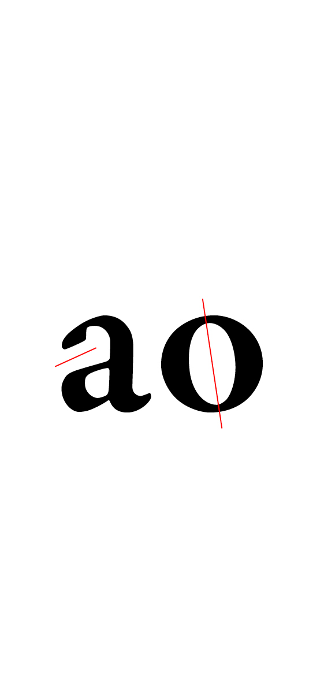 |
|:---:|
| Abc | 

|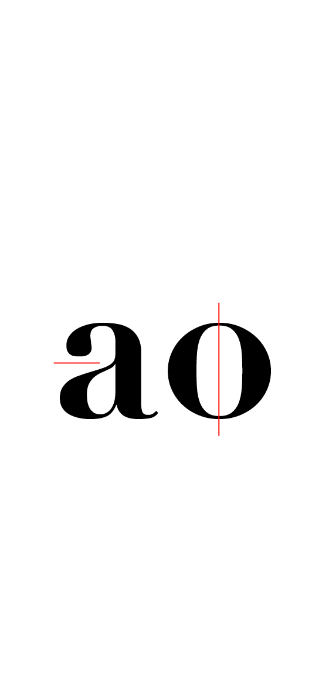 |
|:---:|
| Abc | 

| |
|:---:|
| Abc | 

# Graisse  

|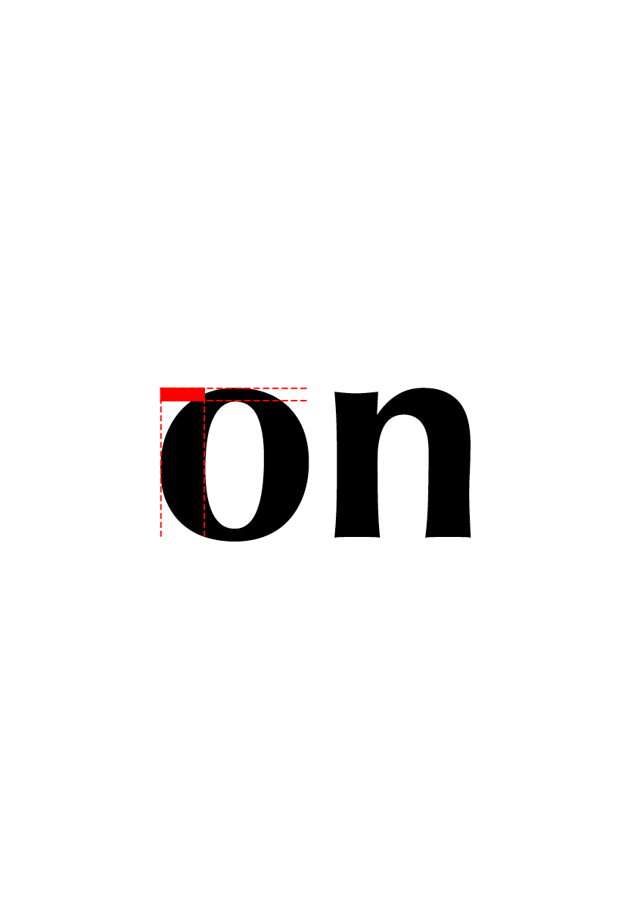 |
|:---:|
| Abc | 

|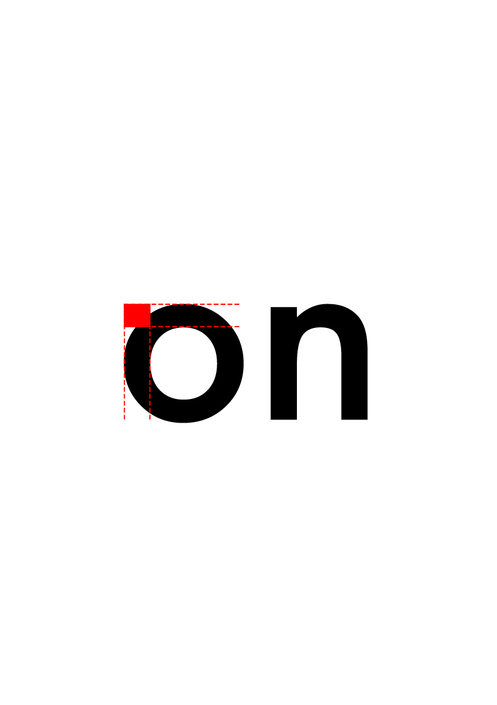 |
|:---:|
| Abc | 

|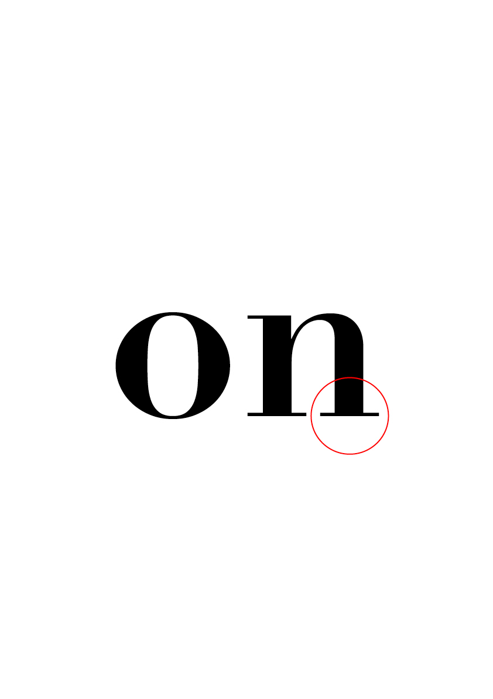 |
|:---:|
| Abc | 

| |
|:---:|
| Abc | 

# Enveloppe  

## Terminaisons  

|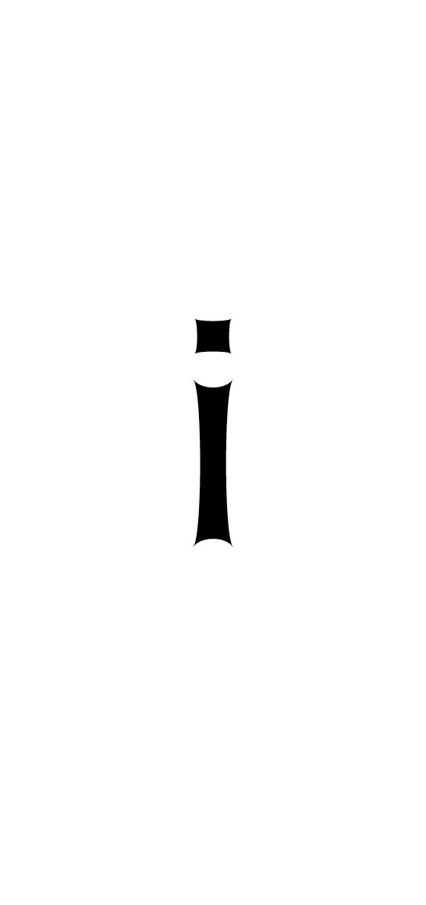 |
|:---:|
| Abc | 

|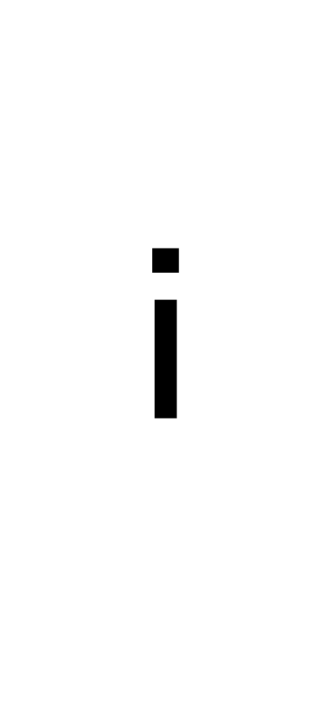 |
|:---:|
| Abc | 

| |
|:---:|
| Abc | 

| |
|:---:|
| Abc | 

## Ouvertures  

| |
|:---:|
| Abc | 

| |
|:---:|
| Abc | 

| |
|:---:|
| Abc | 

## Décorations  

|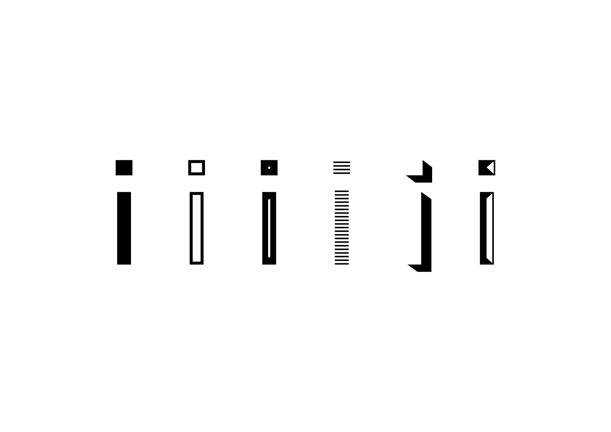 |
|:---:|
| Abc | 

### Sources

<!-- - **Prénom Nom**  
  *Titre*, 0000 -->

<!-- [^1]: Adrian Frutiger, *Type, Sign, Symbol*, 1980 -->

