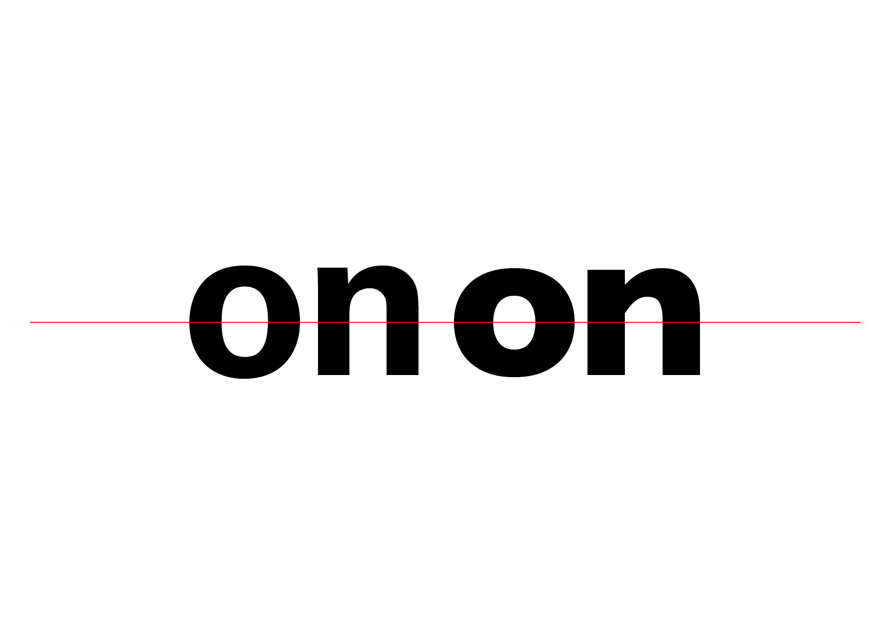
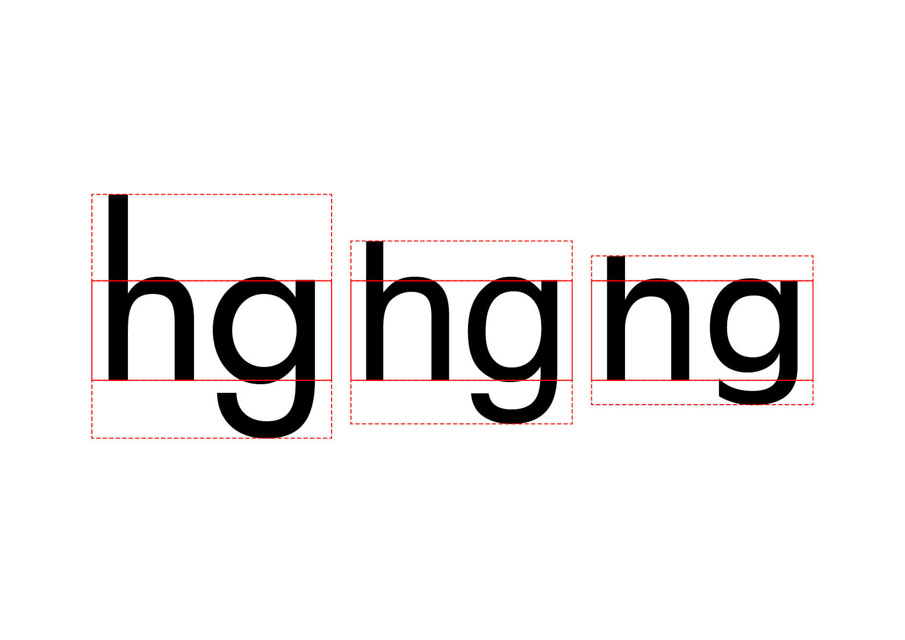

# 🎛️ Variations de style

  
&nbsp;

# Graisse  

Les différentes épaisseurs du trait d'une police de caractères par rapport à ses espaces intérieurs (contreformes), sans modification de la hauteur, sont appelées graisses (ou des cuts).

| |
|:---:|
| Variation de graisse | 

| |
|:---:|
| La hauteur de x reste la même au sein d'une famille | 

Il n'existe pas de normalisation unifiée du rapport de graisse. Par conséquent, la version Bold de l'Univers n'a pas le même poids que l'Helvetica Bold ou le style correspondant de la Gill Sans. 

| |
|:---:|
| Les valeurs de noir pour une même graisse changent d'une famille à l'autre | 

# Largeur  

Pour des grands volume de texte, il est préférable d'utiliser des largeurs romaines, conçues pour une lisibilité optimale. Dans certains cas, des exigences particulières peuvent justifier l'utilisation de styles condensés ou étendus (manque de place, augmentation de la lisiblité).

| |
|:---:|
| Variation de largeur | 

| |
|:---:|
| Les proportions restent les mêmes au sein d'une famille | 

Comme pour les graisses, il n'existe pas de normalisation unifiée des proportions (largeur et hauteur) dans le domaine des largeurs. Chaque famille de polices a ses propres ratios.

| |
|:---:|
| Les proportions changent d'une famille à l'autre | 

# Inclinaison  

Les italiques sont disponibles en complément des polices roman (droites), c'est-à-dire toutes celles qui sont perpendiculaires à la ligne de base. Les italiques sont inclinées dans une seule direction. Il existe 2 sortes d'italic: cursif (forme historique) et penché ou slanted (forme moderne).

| |
|:---:|
| Variation d'inclinaison: cursif et penché | 

| |
|:---:|
| La valeur de noir d'une italique est en général plus légère que son équivalent roman |

L'italique est utilisé pour mettre en évidence certains éléments dans le texte.

### Sources

<!-- - **Prénom Nom**  
  *Titre*, 0000 -->

<!-- [^1]: Adrian Frutiger, *Type, Sign, Symbol*, 1980 -->

