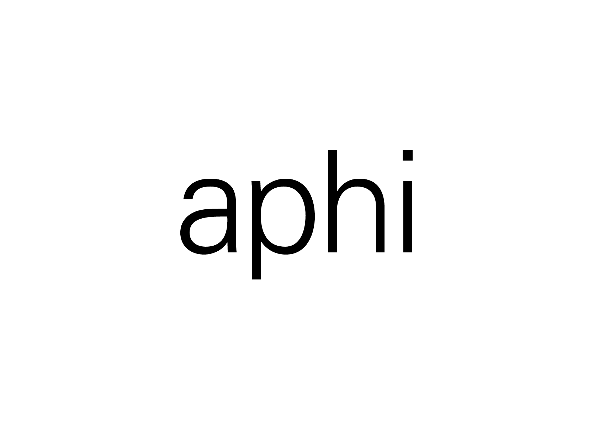
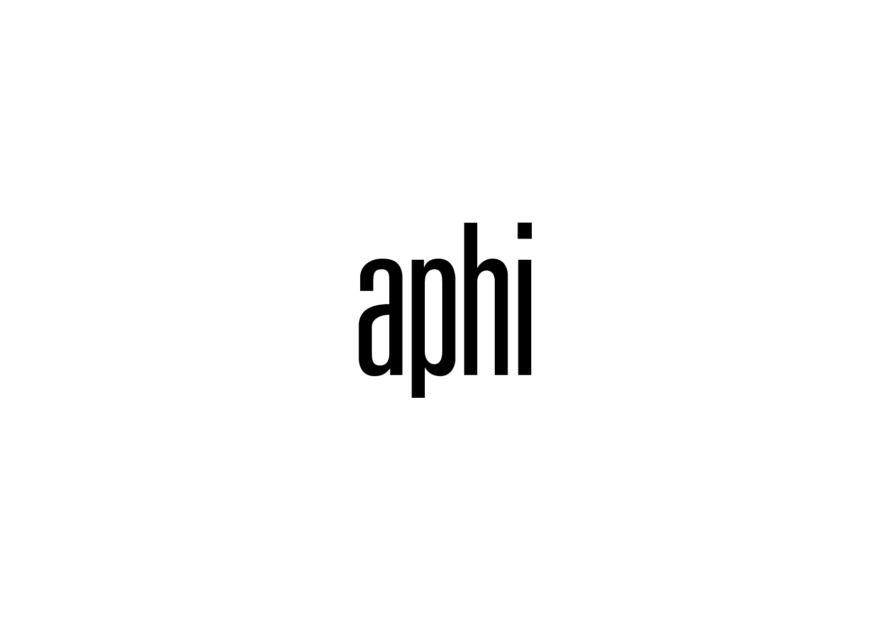
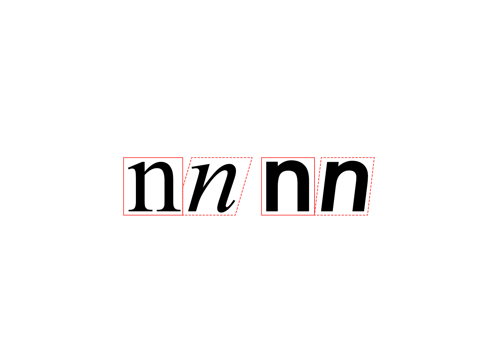
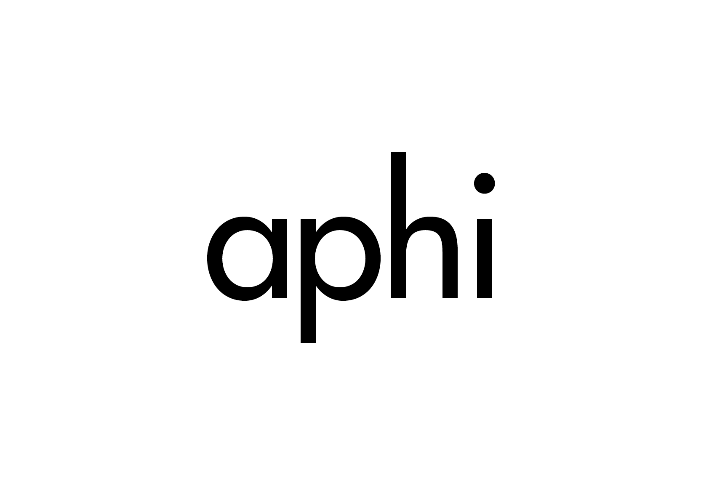

# 🎛️ Variations de style (dans une famille)

  
&nbsp;

# Graisse  

Les différentes épaisseurs du trait d'une police de caractères par rapport à ses espaces intérieurs (contreformes), sans modification de la hauteur, sont appelées graisses (ou des cuts).

| |
|:---:|
| Abc | 

| |
|:---:|
| Abc | 

Il n'existe pas de normalisation unifiée du rapport de graisse. Par conséquent, la version Bold de l'Univers n'a pas le même poids que l'Helvetica Bold ou le style correspondant de la Gill Sans. 

# Largeur  

Pour des grands volume de texte, il est préférable d'utiliser des largeurs romaines, conçues pour une lisibilité optimale. Dans certains cas, des exigences particulières peuvent justifier l'utilisation de styles condensés ou étendus (manque de place, augmentation de la lisiblité).

| |
|:---:|
| Abc | 

| |
|:---:|
| Abc | 

Comme pour les graisses, il n'existe pas de normalisation unifiée des ratios dans le domaine des largeurs. Chaque famille de polices a ses propres proportions.

# Inclinaison  

Les italiques sont disponibles en complément des polices roman (droites), c'est-à-dire toutes celles qui sont perpendiculaires à la ligne de base. Les italiques sont inclinées dans une seule direction. Il existe 2 sortes d'italic: cursif (forme historique) et penché (forme moderne).

| |
|:---:|
| Abc | 

| |
|:---:|
| Abc |

L'italique est utilisé pour mettre en évidence certains éléments dans le texte.

### Sources

<!-- - **Prénom Nom**  
  *Titre*, 0000 -->

<!-- [^1]: Adrian Frutiger, *Type, Sign, Symbol*, 1980 -->

