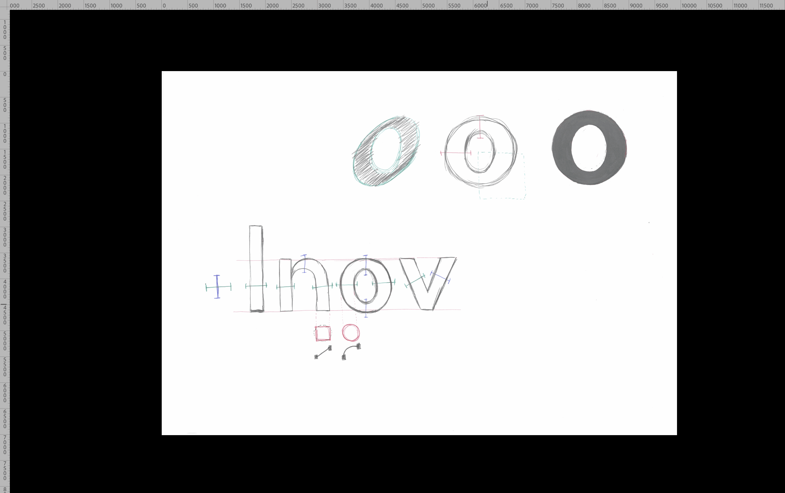

# ⚙️ Support for technical aspects
  Tutoriels pour différents périphériques
### &nbsp;

## 📄 Nommer

| |
|:---:|
| Déposer un rendu           |

## 📠 Scanner

| |
|:---:|
| Scanner un travail           |

## 🌗 Corriger

| |
|:---:|
| Adapter les niveaux d’un scan dans Photoshop: **sélectionner le calque, puis Image > Réglages > Niveaux**           |
