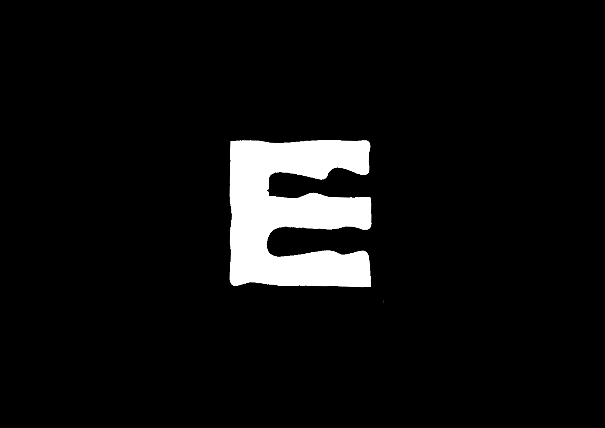
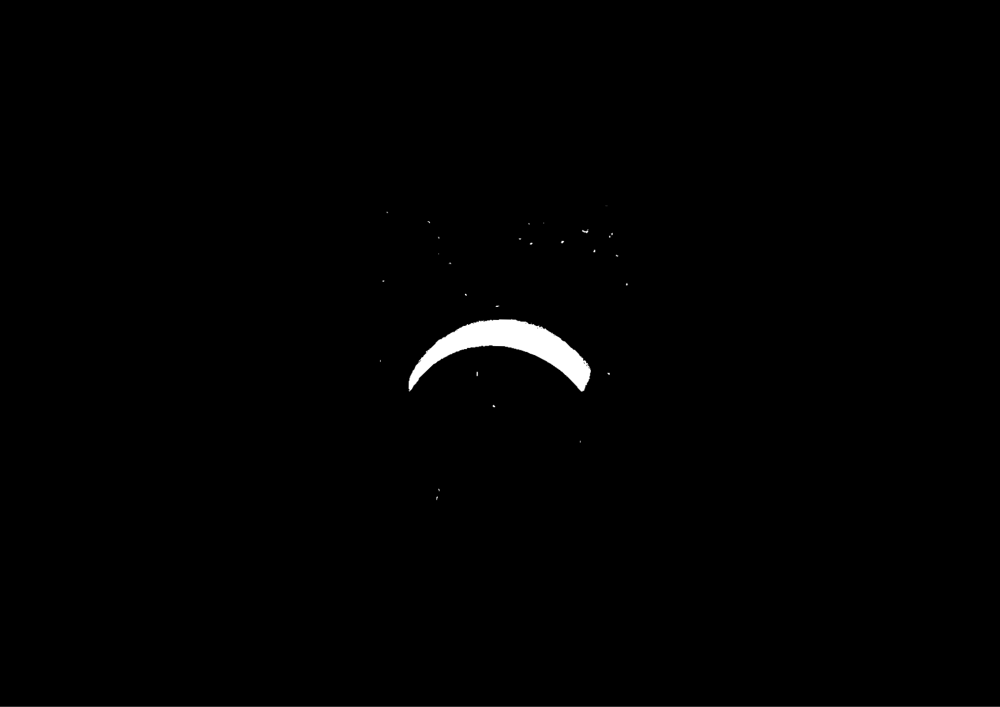
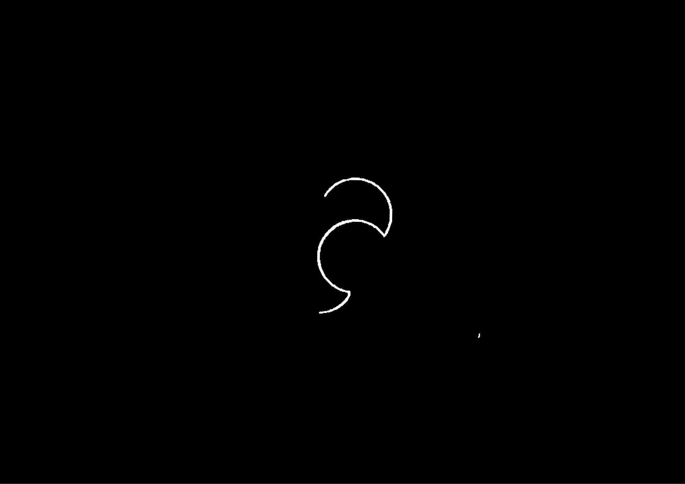

# 📽️ Animation de symboles

En animation, le nombre d’images construit le temps, l’ampleur des changements détermine la vitesse, la variation des formes produit le mouvement et la continuité visuelle assure les transitions.
  
### &nbsp;

| |
|:---:|
| Animation 1 |

| |
|:---:|
| Animation 2 |

| |
|:---:|
| Animation 3 |

<!-- Temps = nombre d’images
Vitesse = écart de changement
Mouvement = variation
Transition = continuité visuelle -->

### Sources

- **Peter von Arx**  
  *Film + Design : Die elementaren Phänomene und Dimensionen des Films im gestalterischen Unterricht*, Haupt, 1983
