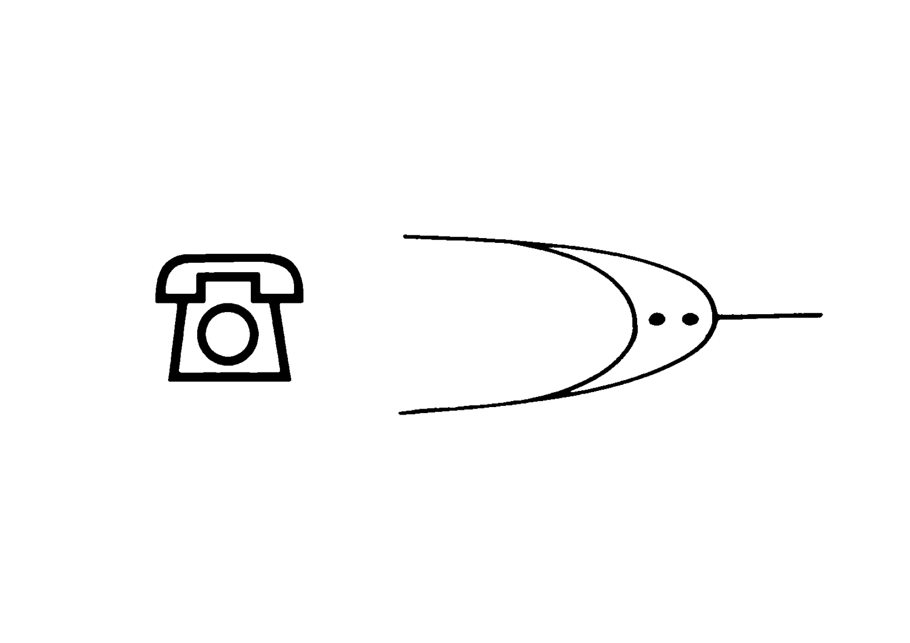

# ♨️ Icône-Symbole

L'icône est un signe orienté vers l’usage (dénotation), le symbole est un signe orienté vers le sens (connotation).
  
### &nbsp;

# Icône vs Sigle

| |
|:---:|
| Sigle (téléphone) vs Symbole (le futur) |

# Valeur symbolique

| |
|:---:|
| La valeur symbolique d'un signe individuel reste souvent cachée et insignifiante. |

# Séquence de symboles

| |
|:---:|
| La présentation d'une séquence de signes ou leur confrontation permet cependant de conférer aux signes une valeur narrative, voire figurative. |

### Sources

- **Adrian Frutiger**  
  *Type, Sign, Symbol*, 1980
