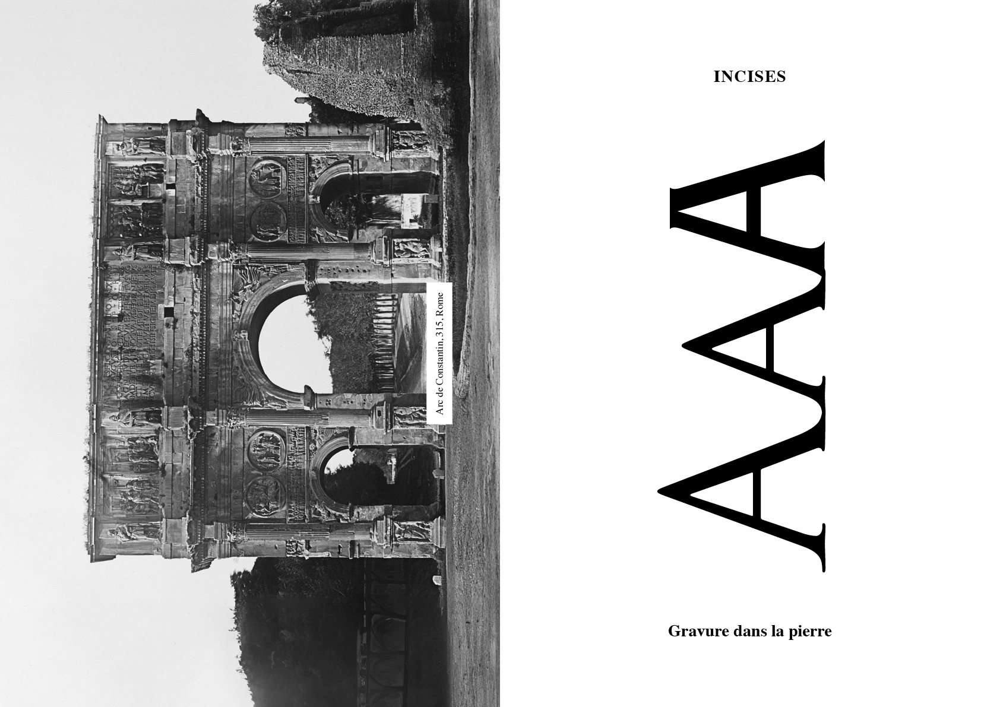
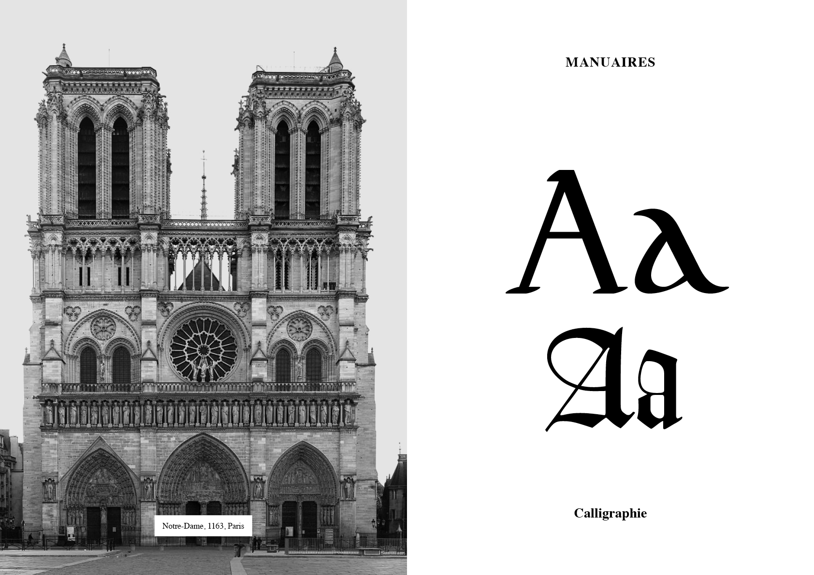
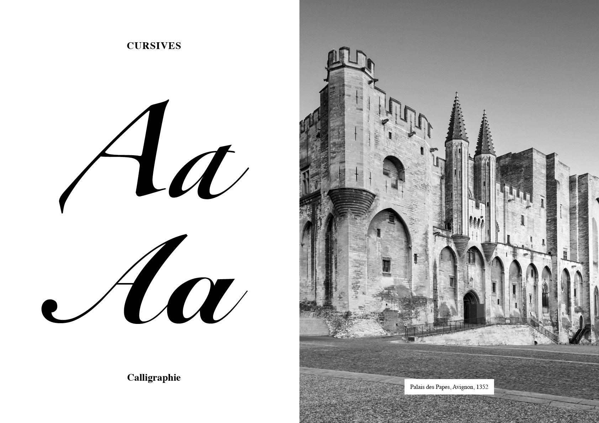
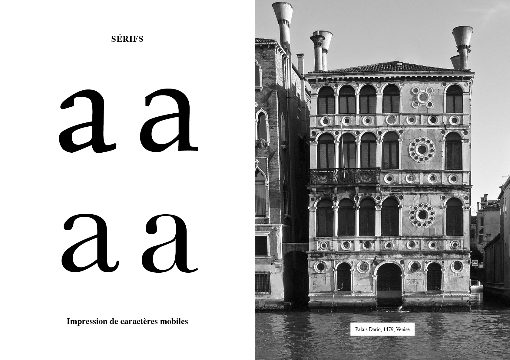
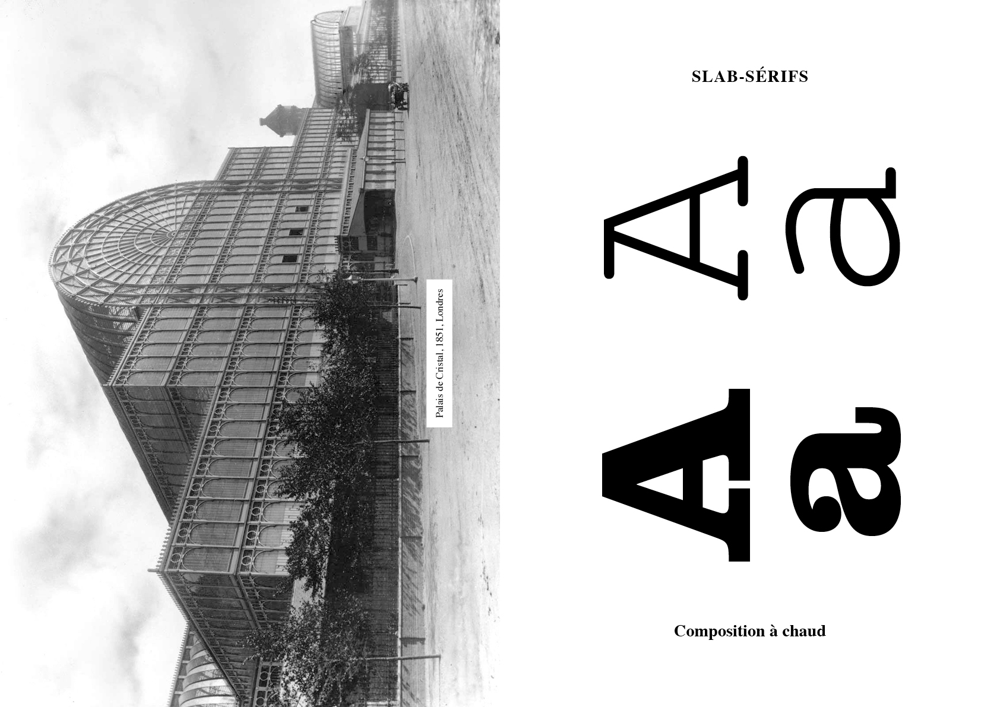
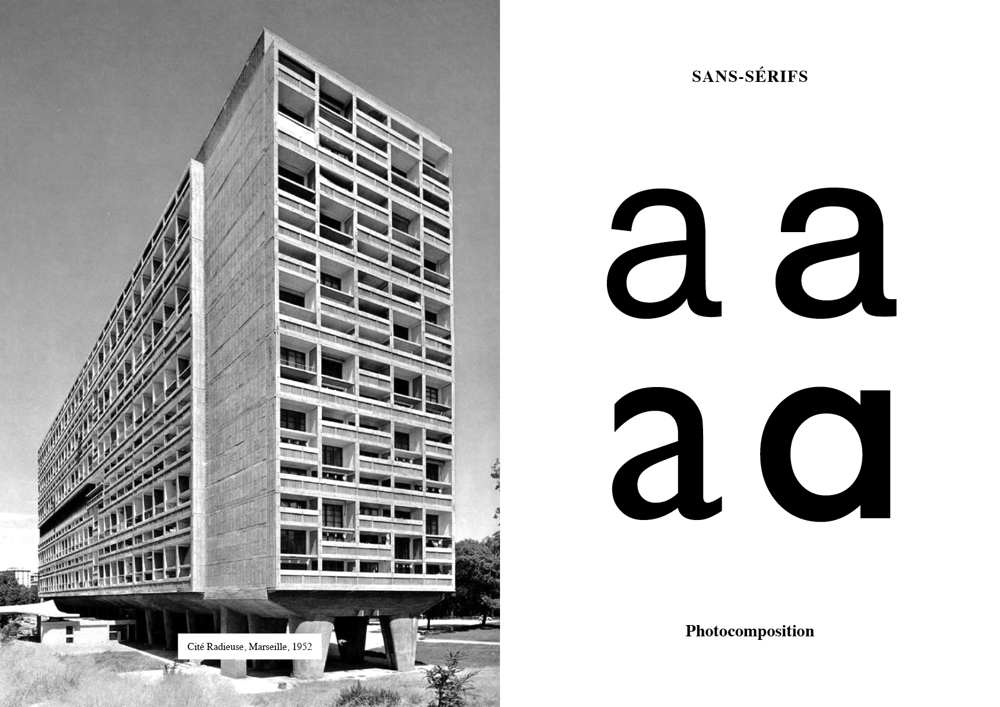
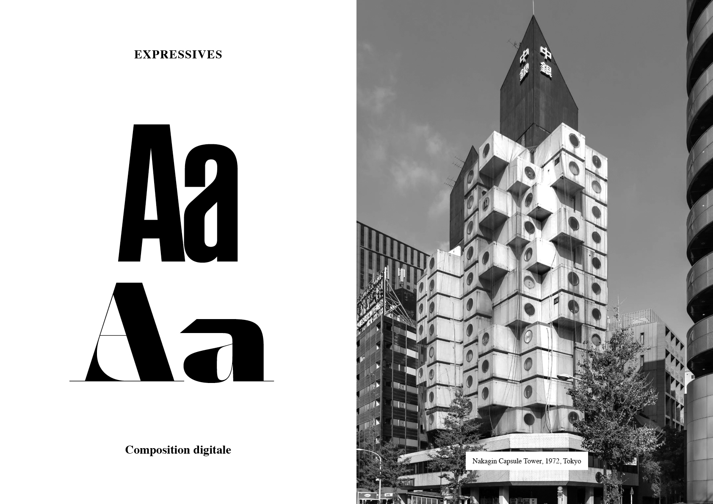
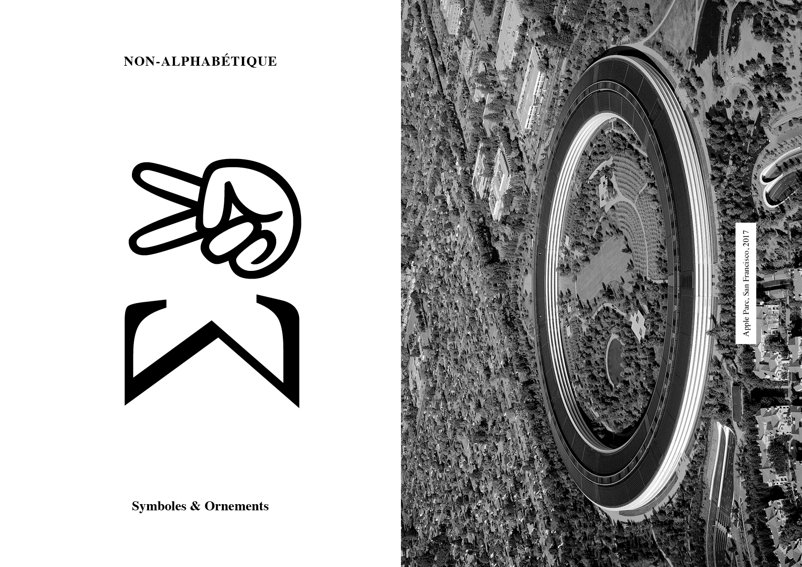

# 🏢 Evolution de l'architecture

  
&nbsp;

# Incises  

| |
|:---:|
| Gravure dans la pierre | 

# Manuaires  

| |
|:---:|
| Calligraphie | 

# Cursives  

| |
|:---:|
| Calligraphie | 

# Sérifs  

| |
|:---:|
| Impression de caractères mobiles | 

# Slab-Sérifs  

| |
|:---:|
| Composition à chaud | 

# Sans-Sérifs  

| |
|:---:|
| Photocomposition | 

# Expressives  

| |
|:---:|
| Composition digitale | 

# Non-alphabétiques  

| |
|:---:|
| Symboles & Ornements |

<!-- ### Sources -->

<!-- - **Prénom Nom**  
  *Titre*, 0000 -->

<!-- [^1]: Adrian Frutiger, *Type, Sign, Symbol*, 1980 -->

