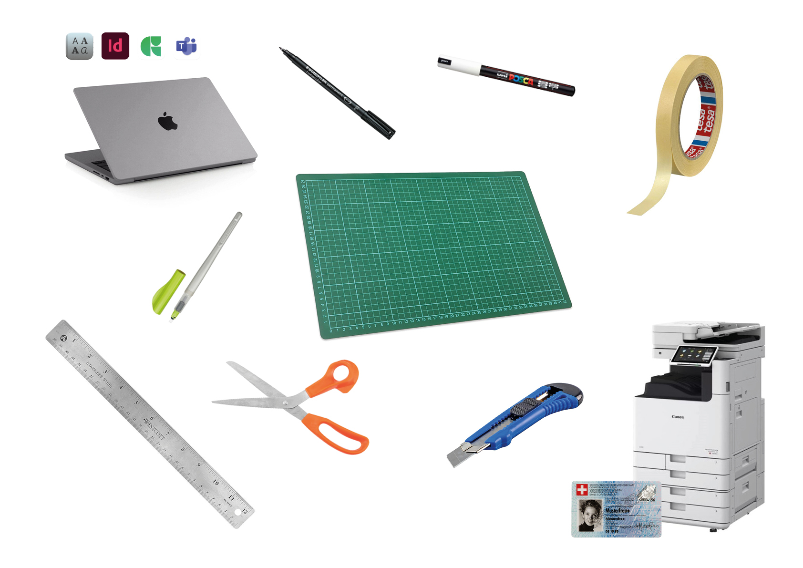

# 🛃 Outils

### &nbsp;

# Matériel

| |
|:---:|
| Matériel pour le cours de typographie |

- Scotch carrossier
- Matériel de découpe
	- Mat ou carton
	- Cutter
	- Ciseaux
- Règle
- Feutre noir
	- fin pour les tracés
	- épais pour le remplissage
- Feutre blanc couvrant
- Plume calligraphique*
- Compte pour accès aux imprimantes (impression / scan)
- Ordinateur
	- Typothèque
	- InDesign
	- Glyphs*
	- Teams

* pour les étudiant.e.s en graphisme