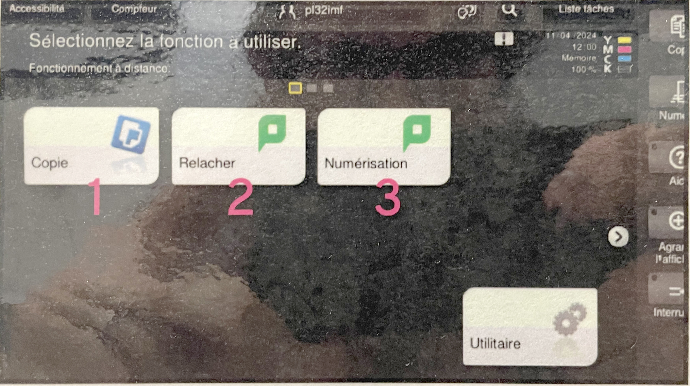
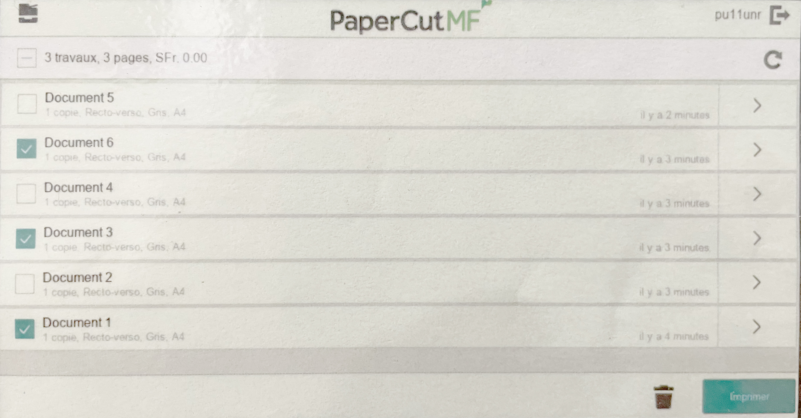
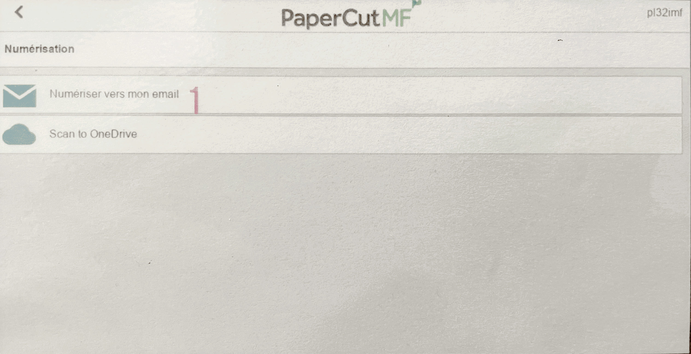

# 🖨️ Imprimantes

### &nbsp;

# Login

| |
|:---:|
| Utiliser l'utilisateur eduvaud (pxxx) et le mot de passe lié | 

# Menu

| |
|:---:|
| Scanner sur une imprimante | 

# Copie: Photocopier

| |
|:---:|
| Copie > Paramètres > Départ | 

# Relâcher: Imprimer

| |
|:---:|
| Sélectionner les travaux / Régler l'option recto-verso / Imprimer | 

# Numérisation: Scanner

| |
|:---:|
| Scanner vers son eMail | 

| |
|:---:|
| Scanner vers son OneDrive | 